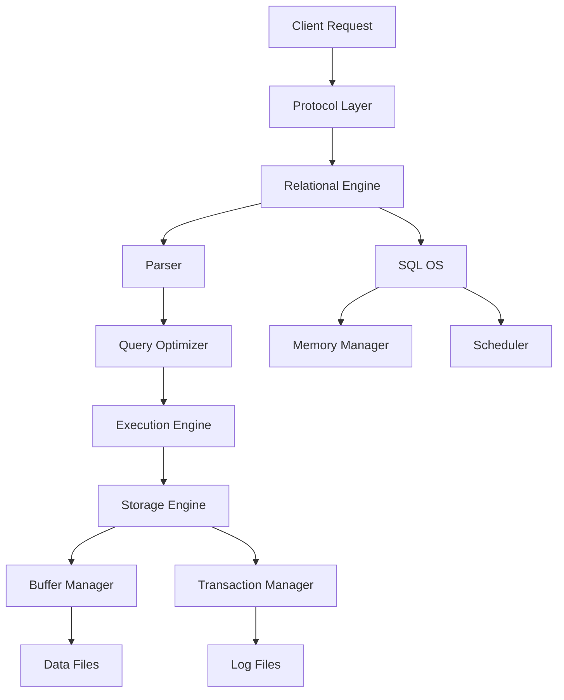

## SQL Server Architecture

Microsoft SQL Server architecture is a **modular, layered system** designed to manage relational data efficiently, maintain integrity, support concurrency, and handle complex queries. It is built on the **client–server model**, where SQL Server acts as the **database engine** providing services to clients via **T-SQL** requests.

---

### High-Level Architecture

```mermaid
flowchart TD;
    A[Client Applications] -->|T-SQL Query| B[Protocol Layer];
    B --> C[Relational Engine];
    C --> D[Query Processor];
    D --> E[Query Optimizer];
    E --> F[Execution Engine];
    C --> G[Storage Engine];
    G --> H[Buffer Manager];
    G --> I[Transaction Manager];
    G --> J[Lock Manager];
    H --> K[Data Files (MDF/NDF)];
    I --> L[Log File (LDF)];
    C --> M[SQL OS];
    M --> N[Memory Manager];
    M --> O[Scheduler];
    M --> P[IO Manager];
```

---

### Main Components

#### Database Engine

The core service that processes, stores, and secures data. It includes two major layers:

##### Relational Engine (Query Processor)

Responsible for query parsing, optimization, and execution.

* **Parser** – Checks syntax and creates a parse tree.
* **Algebrizer** – Resolves object names and data types; generates logical tree.
* **Query Optimizer** – Creates efficient execution plans based on cost estimation.
* **Query Executor** – Executes the plan and interacts with the storage engine for data retrieval or modification.
* **Execution Plans** – May be cached and reused to enhance performance.

##### Storage Engine

Manages physical data access, storage structures, and transaction processing.

* **Access Methods** – Retrieve and update rows, indexes, and pages.
* **Buffer Manager** – Manages pages in memory to reduce disk I/O.
* **Transaction Manager** – Maintains ACID properties and controls transactions.
* **Lock Manager** – Handles concurrency and isolation levels.
* **File Manager** – Handles .mdf, .ndf, and .ldf files.

---

### SQL OS (Operating System Layer)

SQL Server includes a lightweight OS-like layer called **SQL OS** to manage its internal operations, ensuring predictable performance independent of the Windows kernel.

| Component             | Function                                                         |
| --------------------- | ---------------------------------------------------------------- |
| **Memory Manager**    | Allocates memory for caching, query processing, and execution.   |
| **Scheduler**         | Implements cooperative scheduling using SQLOS threads (workers). |
| **I/O Manager**       | Manages asynchronous and efficient read/write operations.        |
| **Resource Monitor**  | Monitors system resources and prevents contention.               |
| **Deadlock Detector** | Detects and resolves deadlocks automatically.                    |

---

### File Structure

| File Type           | Extension                                                                | Description                                  |
| ------------------- | ------------------------------------------------------------------------ | -------------------------------------------- |
| Primary Data File   | `.mdf`                                                                   | Contains startup info and main data objects. |
| Secondary Data File | `.ndf`                                                                   | Optional; used to spread data across disks.  |
| Log File            | `.ldf`                                                                   | Records all transactions for recovery.       |
| TempDB              | System database for temporary tables, sorting, and intermediate results. |                                              |

---

### Memory Architecture

SQL Server uses **Buffer Pool Architecture** to minimize disk access.

* **Buffer Cache** – Stores recently accessed data pages.
* **Plan Cache** – Stores compiled query execution plans.
* **Procedure Cache** – Holds stored procedure execution context.
* **Memory Grants** – Allocated for query sorting and hashing.
* **Lazy Writer & Checkpoint** – Flush dirty pages to disk for consistency.

---

### Transaction Management

* **Transaction Manager** controls atomicity and consistency.
* **Write-Ahead Logging (WAL)** ensures log records are written before data is modified on disk.
* **Recovery Models** define log retention and recovery scope:

  * **Simple**: Minimal logging, no point-in-time recovery.
  * **Full**: Complete log backup and recovery.
  * **Bulk-logged**: Optimized for bulk operations.

---

### Concurrency & Locking

SQL Server uses **pessimistic** and **optimistic** concurrency mechanisms:

* **Lock Modes:** Shared, Exclusive, Update, Intent.
* **Isolation Levels:**

  * Read Uncommitted
  * Read Committed
  * Repeatable Read
  * Serializable
  * Snapshot
* **Row Versioning:** Enables snapshot-based isolation using tempdb.

---

### Query Processing Lifecycle

1. **Client Sends T-SQL Query**
2. **Protocol Layer** accepts query via TCP/IP, Named Pipes, or Shared Memory.
3. **Relational Engine** parses and optimizes the query.
4. **Execution Engine** executes the plan.
5. **Storage Engine** retrieves or modifies data.
6. **Results returned** to client through protocol layer.

---

### System Databases

| Database     | Purpose                                           |
| ------------ | ------------------------------------------------- |
| **master**   | Stores system-level configuration and login info. |
| **model**    | Template for new databases.                       |
| **msdb**     | Supports SQL Agent jobs, alerts, and backups.     |
| **tempdb**   | Used for temporary objects and query processing.  |
| **resource** | Hidden database containing system objects.        |

---

### Services and Components

| Service                                    | Description                               |
| ------------------------------------------ | ----------------------------------------- |
| **SQL Server Database Engine**             | Core RDBMS for data storage and querying. |
| **SQL Server Agent**                       | Automates scheduled jobs and tasks.       |
| **SQL Server Browser**                     | Manages incoming client connections.      |
| **SQL Server Integration Services (SSIS)** | ETL and data transformation.              |
| **SQL Server Analysis Services (SSAS)**    | OLAP and data mining.                     |
| **SQL Server Reporting Services (SSRS)**   | Reporting and visualization.              |

---

### High Availability Architecture

* **Failover Clustering**: Provides hardware-level redundancy.
* **Always On Availability Groups**: Offers database-level replication and failover.
* **Log Shipping**: Ships transaction logs to secondary servers.
* **Replication**: Distributes data across databases for load balancing or reporting.

---

### Diagram: Simplified Internal Flow



---

### Key Architectural Principles

* **Layered abstraction** for modularity and performance isolation.
* **Cost-based optimization** for intelligent query planning.
* **Caching and buffer management** to reduce physical I/O.
* **Concurrent access** with controlled isolation and consistency.
* **Fault tolerance** through transaction logging and checkpoints.

---
