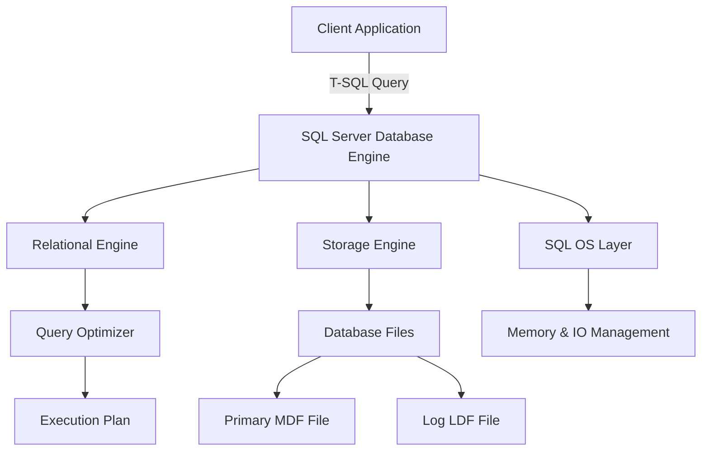

## Microsoft SQL Server

Microsoft SQL Server is a **Relational Database Management System (RDBMS)** developed by **Microsoft**, designed to store, manage, and retrieve data efficiently using **Structured Query Language (T-SQL)**, Microsoft’s proprietary SQL extension. It supports **transactional processing**, **business intelligence**, and **analytics** applications across various architectures and deployment environments (on-premises, hybrid, and cloud).

---

### Core Architecture

* **Database Engine**
  Central component responsible for data storage, query processing, and transaction management.

  * **Relational Engine**: Parses, optimizes, and executes T-SQL queries.
  * **Storage Engine**: Manages files, pages, indexes, and buffer management.
  * **Transaction Manager**: Ensures ACID compliance (Atomicity, Consistency, Isolation, Durability).

* **SQL OS (Operating System Layer)**
  Handles low-level operations such as memory management, scheduling, and I/O processing. It acts as a lightweight abstraction layer between the Windows OS and SQL Server components.

* **Database Files**

  * `.mdf` → Primary data file (contains system tables and user data).
  * `.ndf` → Secondary data file (optional, for data spread).
  * `.ldf` → Log file (stores transaction logs for recovery).

* **TempDB**
  A system database for temporary storage, intermediate results, and internal operations.

---

### Key Features

* **T-SQL (Transact-SQL)**
  Microsoft’s SQL dialect that extends ANSI SQL with procedural constructs, error handling, transactions, and system functions.

* **ACID Transactions**
  Guaranteed data integrity for concurrent operations through locking and isolation mechanisms.

* **Security Model**

  * Authentication: Windows Authentication & SQL Server Authentication.
  * Authorization: Role-based access control.
  * Encryption: Transparent Data Encryption (TDE), Always Encrypted.
  * Auditing: Logs security-related actions and changes.

* **Indexing and Performance Optimization**

  * Clustered and Non-clustered Indexes.
  * Columnstore Indexes for analytics.
  * Query Optimizer uses a cost-based model.
  * Execution Plans help diagnose and tune performance.

* **Concurrency Control**
  Utilizes locking and row versioning for transaction isolation. Supports multiple isolation levels:

  * Read Uncommitted
  * Read Committed
  * Repeatable Read
  * Serializable
  * Snapshot

* **High Availability and Disaster Recovery (HADR)**

  * **Always On Availability Groups**: High availability and failover support.
  * **Database Mirroring**: Synchronous/asynchronous replication.
  * **Log Shipping** and **Replication**: Data redundancy and load distribution.

* **Integration and Services**

  * **SQL Server Integration Services (SSIS)**: ETL (Extract, Transform, Load) operations.
  * **SQL Server Reporting Services (SSRS)**: Report generation and visualization.
  * **SQL Server Analysis Services (SSAS)**: OLAP cubes and data mining.
  * **Machine Learning Services**: Integration with R and Python for analytics.

---

### Editions

| Edition        | Description                                                              |
| -------------- | ------------------------------------------------------------------------ |
| **Express**    | Free, lightweight edition for small applications.                        |
| **Standard**   | Includes core features for medium-scale workloads.                       |
| **Enterprise** | Full feature set with maximum scalability, HADR, and advanced analytics. |
| **Developer**  | Same features as Enterprise but for development/testing.                 |
| **Web**        | Optimized for web hosting environments.                                  |

---

### Deployment Models

* **On-premises**: Installed on Windows Server environments.
* **Cloud (Azure SQL)**: Managed instance or database on Microsoft Azure.
* **Hybrid**: Combines on-premises and cloud features for flexibility.

---

### Tools and Interfaces

* **SQL Server Management Studio (SSMS)** – GUI for database management and query execution.
* **Azure Data Studio** – Cross-platform interface for SQL and Azure databases.
* **sqlcmd** – Command-line utility for SQL Server operations.
* **Profiler** – For tracing and monitoring SQL queries.

---

### Data Storage and Processing

* **Row-based Storage**: Optimized for transactional workloads (OLTP).
* **Columnstore Storage**: Optimized for analytical workloads (OLAP).
* **In-Memory OLTP (Hekaton)**: Uses memory-optimized tables for faster performance.

---

### SQL Compliance and Standards

* **T-SQL** is **partially ANSI SQL-compliant**, meaning core SQL syntax follows standards, but Microsoft-specific features (like system functions and procedural extensions) go beyond ANSI compliance.

---

### Use Cases

* Enterprise transactional systems (ERP, CRM)
* Data warehouses and analytical processing
* Web and application backends
* Machine learning model deployment via stored procedures
* Real-time reporting and dashboards

---

### Internal Processes

* **Query Lifecycle**

  * Parsing → Optimization → Execution → Result Fetching
* **Recovery Model Types**

  * Simple: Truncates log after checkpoint.
  * Full: Requires backups to maintain logs.
  * Bulk-logged: Optimized for bulk operations.

---

### Diagram

---
