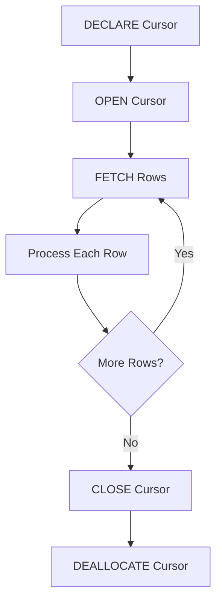

## **Cursors in MS SQL Server**

---

### **Overview**

A **Cursor** in SQL Server is a **database object** used to **retrieve, manipulate, and traverse** query results **row by row** rather than as a complete set. While SQL is set-based, cursors are procedural — useful for operations that need **row-level processing** (e.g., sequential updates or conditional logic).

---

### **When to Use Cursors**

* When each row requires **individual processing** not achievable with set-based operations.
* For **complex business logic** involving multiple dependent queries.
* When iterating through **temporary or dynamic data sets**.

---

### **Cursor Workflow**

1. **Declare the Cursor** — Define name and query.
2. **Open the Cursor** — Execute query and populate result set.
3. **Fetch Rows** — Retrieve one row at a time.
4. **Process Data** — Apply logic or updates.
5. **Close the Cursor** — Release result set memory.
6. **Deallocate the Cursor** — Remove cursor definition.

---

### **Syntax**

```sql
-- Step 1: Declare Cursor
DECLARE cursor_name CURSOR
FOR
SELECT column1, column2 FROM table_name;

-- Step 2: Open Cursor
OPEN cursor_name;

-- Step 3: Fetch Rows
FETCH NEXT FROM cursor_name INTO @var1, @var2;

-- Step 4: Loop Through Rows
WHILE @@FETCH_STATUS = 0
BEGIN
    -- Perform row-level operations
    PRINT @var1;

    FETCH NEXT FROM cursor_name INTO @var1, @var2;
END;

-- Step 5: Close and Deallocate
CLOSE cursor_name;
DEALLOCATE cursor_name;
```

---

### **Types of Cursors**

#### **1. Based on Visibility**

* **Local Cursor**: Exists only in the current batch/procedure.
* **Global Cursor**: Accessible across the entire session.

#### **2. Based on Data Sensitivity**

* **Static**: Snapshot of data; changes in base table are not visible.
* **Dynamic**: Reflects all changes in base table during cursor lifetime.
* **Keyset-driven**: Stable keyset of rows, but data changes are visible.

#### **3. Based on Scrolling Ability**

* **Forward-only**: Can move only from first to last row.
* **Scrollable**: Can move both forward and backward.

---

### **Cursor Options**

```sql
DECLARE cursor_name CURSOR
SCROLL STATIC READ_ONLY FOR
SELECT column1, column2 FROM table_name;
```

| Option                        | Description                                                        |
| ----------------------------- | ------------------------------------------------------------------ |
| **FORWARD_ONLY**              | Fetches rows sequentially from start to end.                       |
| **SCROLL**                    | Allows movement to specific rows (FIRST, LAST, PRIOR, ABSOLUTE n). |
| **STATIC**                    | Creates a temporary snapshot; no updates visible.                  |
| **DYNAMIC**                   | Reflects all data changes while cursor is open.                    |
| **KEYSET**                    | Fixed key values; data updates visible, insert/delete not.         |
| **READ_ONLY**                 | Prevents updating data via cursor.                                 |
| **OPTIMISTIC / SCROLL_LOCKS** | Used for concurrent updates.                                       |

---

### **Cursor Fetch Directions**

```sql
FETCH NEXT FROM cursor_name;
FETCH PRIOR FROM cursor_name;
FETCH FIRST FROM cursor_name;
FETCH LAST FROM cursor_name;
FETCH ABSOLUTE 5 FROM cursor_name;
FETCH RELATIVE -2 FROM cursor_name;
```

---

### **Advantages**

* Enables **row-by-row** logic for complex business rules.
* Provides **fine-grained control** over data manipulation.
* Useful in **procedural operations** and **administrative tasks**.

---

### **Disadvantages**

* **Slow performance** — processes one row at a time.
* **High memory and CPU usage**.
* **Difficult to scale** for large datasets.
* **Better replaced by** set-based queries using joins, CASE, or window functions.

---

### **Alternatives**

* **Set-based operations** (preferred in SQL).
* **Temporary tables or table variables**.
* **WHILE loops with SELECT/UPDATE** logic.
* **MERGE statements** for conditional updates.

---

### **Best Practices**

* Use cursors **only when necessary**.
* Always **close and deallocate** cursors.
* Prefer **FAST_FORWARD** option for simple one-way iteration:

  ```sql
  DECLARE cur CURSOR FAST_FORWARD FOR SELECT column FROM table;
  ```
* Use **READ_ONLY** if updates aren’t needed.
* Test for **performance impact** before production use.

---

### **Mermaid Diagram**



---
