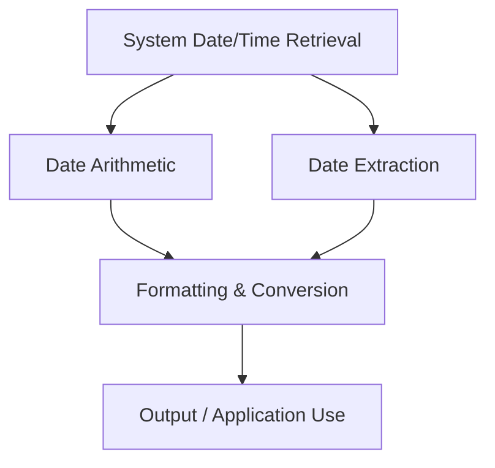

## Date and Time Functions in T-SQL

**Date and Time Functions** in T-SQL are used to manipulate, extract, and calculate date and time values.
They provide utilities to get the current system date/time, perform arithmetic, extract components, and format date-time values.

---

### Categories of Date and Time Functions

| Category                   | Description                            | Examples                                                        |
| -------------------------- | -------------------------------------- | --------------------------------------------------------------- |
| System Date & Time         | Retrieve current system date and time  | `GETDATE()`, `SYSDATETIME()`, `CURRENT_TIMESTAMP`               |
| Date Part Extraction       | Extract individual date or time parts  | `YEAR()`, `MONTH()`, `DAY()`, `DATEPART()`                      |
| Date Creation & Conversion | Construct or convert dates             | `DATEFROMPARTS()`, `DATETIMEFROMPARTS()`, `CAST()`, `CONVERT()` |
| Date Arithmetic            | Add, subtract, or find difference      | `DATEADD()`, `DATEDIFF()`, `EOMONTH()`                          |
| System Timezone            | Return system UTC or offset-based date | `GETUTCDATE()`, `SYSDATETIMEOFFSET()`, `SWITCHOFFSET()`         |
| Formatting                 | Display date/time in specific style    | `FORMAT()`                                                      |

---

### 1. System Date and Time Functions

| Function                | Returns                                  | Precision | Example                       |
| ----------------------- | ---------------------------------------- | --------- | ----------------------------- |
| **GETDATE()**           | Current date & time (datetime)           | 3 ms      | `SELECT GETDATE();`           |
| **SYSDATETIME()**       | Current date & time (datetime2)          | 100 ns    | `SELECT SYSDATETIME();`       |
| **GETUTCDATE()**        | Current UTC datetime                     | 3 ms      | `SELECT GETUTCDATE();`        |
| **SYSUTCDATETIME()**    | UTC datetime (datetime2)                 | 100 ns    | `SELECT SYSUTCDATETIME();`    |
| **SYSDATETIMEOFFSET()** | Date & time with offset                  | 100 ns    | `SELECT SYSDATETIMEOFFSET();` |
| **CURRENT_TIMESTAMP**   | Same as `GETDATE()` (ANSI-SQL compliant) | 3 ms      | `SELECT CURRENT_TIMESTAMP;`   |

---

### 2. Extracting Parts of a Date

| Function                 | Description                                    | Example                                   | Output   |
| ------------------------ | ---------------------------------------------- | ----------------------------------------- | -------- |
| **YEAR(date)**           | Extracts year                                  | `SELECT YEAR('2025-10-24');`              | `2025`   |
| **MONTH(date)**          | Extracts month                                 | `SELECT MONTH('2025-10-24');`             | `10`     |
| **DAY(date)**            | Extracts day                                   | `SELECT DAY('2025-10-24');`               | `24`     |
| **DATEPART(part, date)** | Returns integer part (year, month, week, etc.) | `SELECT DATEPART(WEEKDAY, '2025-10-24');` | `6`      |
| **DATENAME(part, date)** | Returns name of date part                      | `SELECT DATENAME(WEEKDAY, '2025-10-24');` | `Friday` |

#### Common `part` Arguments

| Part                 | Meaning     |
| -------------------- | ----------- |
| `year`, `yy`, `yyyy` | Year        |
| `quarter`, `qq`, `q` | Quarter     |
| `month`, `mm`, `m`   | Month       |
| `day`, `dd`, `d`     | Day         |
| `weekday`, `dw`, `w` | Day of week |
| `hour`, `hh`         | Hour        |
| `minute`, `mi`, `n`  | Minute      |
| `second`, `ss`, `s`  | Second      |
| `millisecond`, `ms`  | Millisecond |

---

### 3. Creating and Constructing Dates

| Function                                 | Description                           | Example                                                        | Output                        |
| ---------------------------------------- | ------------------------------------- | -------------------------------------------------------------- | ----------------------------- |
| **DATEFROMPARTS(y,m,d)**                 | Create date (date)                    | `SELECT DATEFROMPARTS(2025,10,24);`                            | `2025-10-24`                  |
| **DATETIMEFROMPARTS(y,m,d,hh,mi,ss,ms)** | Create datetime                       | `SELECT DATETIMEFROMPARTS(2025,10,24,14,30,0,0);`              | `2025-10-24 14:30:00.000`     |
| **DATETIME2FROMPARTS(...)**              | Create datetime2 with precision       | `SELECT DATETIME2FROMPARTS(2025,10,24,14,30,0,0,7);`           | `2025-10-24 14:30:00.0000000` |
| **SMALLDATETIMEFROMPARTS(y,m,d,hh,mi)**  | Create smalldatetime                  | `SELECT SMALLDATETIMEFROMPARTS(2025,10,24,14,30);`             | `2025-10-24 14:30:00`         |
| **DATETIMEOFFSETFROMPARTS(...)**         | Create datetime with time zone offset | `SELECT DATETIMEOFFSETFROMPARTS(2025,10,24,14,30,0,0,5,30,7);` | `2025-10-24 14:30:00 +05:30`  |

---

### 4. Date Arithmetic

#### **DATEADD()** — Add Interval to Date

```sql
SELECT DATEADD(DAY, 10, '2025-10-24');  -- Add 10 days
```

→ `2025-11-03`

---

#### **DATEDIFF()** — Difference Between Two Dates

```sql
SELECT DATEDIFF(DAY, '2025-10-01', '2025-10-24');  -- 23 days
```

| Interval                   | Description      |
| -------------------------- | ---------------- |
| `year`                     | Year difference  |
| `month`                    | Month difference |
| `day`                      | Day difference   |
| `hour`, `minute`, `second` | Time difference  |

---

#### **EOMONTH()** — End of Month Date

```sql
SELECT EOMONTH('2025-10-24');  -- 2025-10-31
SELECT EOMONTH('2025-10-24', 1);  -- +1 month → 2025-11-30
```

---

### 5. Conversion and Formatting

#### **CAST()** — Convert Between Data Types

```sql
SELECT CAST('2025-10-24 12:30:00' AS DATE);
```

#### **CONVERT()** — Convert with Style Codes

```sql
SELECT CONVERT(VARCHAR, GETDATE(), 103);  -- dd/mm/yyyy
```

| Style | Format              | Example               |
| ----- | ------------------- | --------------------- |
| 101   | mm/dd/yyyy          | `10/24/2025`          |
| 103   | dd/mm/yyyy          | `24/10/2025`          |
| 112   | yyyymmdd            | `20251024`            |
| 120   | yyyy-mm-dd hh:mi:ss | `2025-10-24 12:30:00` |
| 126   | ISO8601             | `2025-10-24T12:30:00` |

---

#### **FORMAT()** — Custom .NET Style Formatting

```sql
SELECT FORMAT(GETDATE(), 'dddd, MMMM dd, yyyy hh:mm tt');
```

→ `Friday, October 24, 2025 09:30 PM`

---

### 6. Time Zone and Offset Functions

| Function                                 | Description                          | Example                                               |
| ---------------------------------------- | ------------------------------------ | ----------------------------------------------------- |
| **SYSDATETIMEOFFSET()**                  | Current date-time with system offset | `2025-10-24 21:20:00 +05:30`                          |
| **TODATETIMEOFFSET(datetime2, offset)**  | Attach a new time zone offset        | `SELECT TODATETIMEOFFSET(SYSDATETIME(), '+02:00');`   |
| **SWITCHOFFSET(datetimeoffset, offset)** | Convert datetime to a new offset     | `SELECT SWITCHOFFSET(SYSDATETIMEOFFSET(), '-08:00');` |

---

### 7. Logical & Utility Functions

| Function               | Description                            | Example                                              | Output           |
| ---------------------- | -------------------------------------- | ---------------------------------------------------- | ---------------- |
| **ISDATE(expression)** | Returns 1 if valid date                | `SELECT ISDATE('2025-10-24');`                       | `1`              |
| **DATEADD()**          | Add/subtract interval                  | `DATEADD(HOUR, -5, GETDATE())`                       | Subtract 5 hours |
| **DATEDIFF_BIG()**     | Large range difference (bigint result) | `DATEDIFF_BIG(MILLISECOND, '2000-01-01', GETDATE())` | bigint count     |

---

### 8. Examples of Common Date Queries

#### Get First and Last Day of Month

```sql
SELECT 
    DATEADD(DAY, 1, EOMONTH(GETDATE(), -1)) AS FirstDay,
    EOMONTH(GETDATE()) AS LastDay;
```

#### Find Age from DOB

```sql
SELECT DATEDIFF(YEAR, '2000-04-15', GETDATE()) AS Age;
```

#### Get Orders from Last 7 Days

```sql
SELECT * FROM Orders
WHERE OrderDate >= DATEADD(DAY, -7, GETDATE());
```

#### Format Date for Logging

```sql
SELECT FORMAT(SYSDATETIME(), 'yyyyMMdd_HHmmss');
```

---

### 9. Date and Time Data Types in SQL Server

| Data Type             | Range                       | Precision    | Storage    | Description               |
| --------------------- | --------------------------- | ------------ | ---------- | ------------------------- |
| **date**              | 0001-01-01 → 9999-12-31     | Day          | 3 bytes    | Date only                 |
| **time(p)**           | 00:00:00 → 23:59:59.9999999 | Up to 100 ns | 3–5 bytes  | Time only                 |
| **datetime**          | 1753 → 9999                 | 3 ms         | 8 bytes    | Legacy type               |
| **smalldatetime**     | 1900 → 2079                 | 1 minute     | 4 bytes    | Rounded to nearest minute |
| **datetime2(p)**      | 0001 → 9999                 | 100 ns       | 6–8 bytes  | Extended precision        |
| **datetimeoffset(p)** | Same as datetime2 + offset  | 100 ns       | 8–10 bytes | With timezone offset      |

---

### 10. Concept Diagram



---

### Best Practices

* Use `SYSDATETIME()` or `SYSUTCDATETIME()` for higher precision.
* Prefer `datetime2` over `datetime` for new projects.
* Use `EOMONTH()` for end-of-month logic instead of manual calculation.
* Always use UTC for global applications and convert to local using `SWITCHOFFSET()`.
* Avoid string-based date manipulation for performance and reliability.

---
