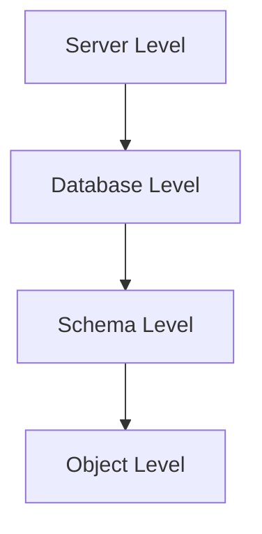
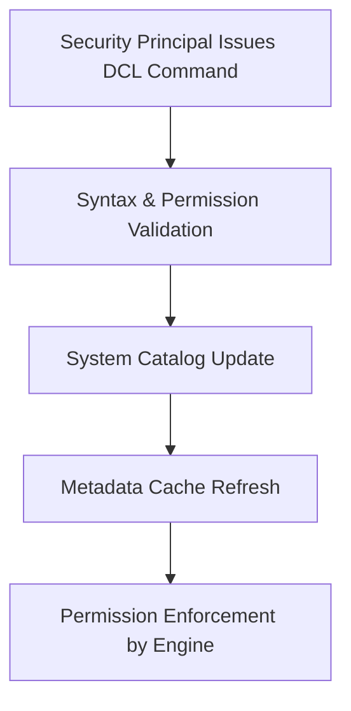

## DCL (Data Control Language) in T-SQL

**Data Control Language (DCL)** in **T-SQL** manages **access control, permissions, and security** within a SQL Server environment. It ensures that users and roles can perform only authorized operations on databases and schema objects. DCL governs **who can access what**, **at what level**, and **what actions** they can perform.

---

### Core Role of DCL

* Defines and enforces **database-level and object-level permissions**.
* Manages **security principals** (logins, users, and roles).
* Provides fine-grained **authorization control**.
* Works closely with **SQL Server security hierarchy** — Server, Database, Schema, and Object levels.
* Integrates with **Windows Authentication** or **SQL Server Authentication**.

---

### Primary DCL Commands

| Command  | Description                                            |
| -------- | ------------------------------------------------------ |
| `GRANT`  | Gives specific permissions to users, roles, or logins. |
| `REVOKE` | Removes previously granted permissions.                |
| `DENY`   | Explicitly blocks permissions, overriding `GRANT`.     |

---

### SQL Server Security Hierarchy



| Level    | Examples of Principals | Examples of Secured Objects      |
| -------- | ---------------------- | -------------------------------- |
| Server   | Logins, Server Roles   | Databases, Endpoints             |
| Database | Users, Database Roles  | Tables, Views, Stored Procedures |
| Schema   | Schema Owners          | Objects within schema            |
| Object   | Direct object access   | Table rows, columns, etc.        |

---

### `GRANT` Command

Assigns permissions to allow actions on database objects.

#### Syntax

```sql
GRANT permission_name
ON securable TO principal
[WITH GRANT OPTION];
```

| Parameter           | Description                                                     |
| ------------------- | --------------------------------------------------------------- |
| `permission_name`   | Type of access (e.g., SELECT, INSERT, UPDATE, DELETE, EXECUTE). |
| `securable`         | Object or scope (e.g., TABLE, DATABASE, SCHEMA).                |
| `principal`         | User, role, or login receiving the permission.                  |
| `WITH GRANT OPTION` | Allows recipient to grant same permission to others.            |

Example:

```sql
GRANT SELECT, UPDATE ON Employees TO HR_User;
GRANT EXECUTE ON OBJECT::usp_GetReport TO Manager WITH GRANT OPTION;
```

---

### `REVOKE` Command

Removes previously granted permissions but does not prevent them from being reassigned later.

#### Syntax

```sql
REVOKE [GRANT OPTION FOR] permission_name
ON securable FROM principal;
```

Example:

```sql
REVOKE SELECT, UPDATE ON Employees FROM HR_User;
```

#### Notes

* If a user inherits permission through a role, **REVOKE** does not affect inherited permissions.
* Use `GRANT OPTION FOR` to revoke only the ability to re-grant permissions.

---

### `DENY` Command

Explicitly blocks permission regardless of inherited rights.

#### Syntax

```sql
DENY permission_name
ON securable TO principal;
```

Example:

```sql
DENY DELETE ON Employees TO HR_User;
```

#### Notes

* Overrides both **GRANT** and **role-based** permissions.
* Use carefully — can cause confusion if combined with role inheritance.

---

### Common Permissions

| Scope              | Permissions Examples                                            |
| ------------------ | --------------------------------------------------------------- |
| **Server Level**   | `ALTER ANY LOGIN`, `CREATE DATABASE`, `SHUTDOWN`                |
| **Database Level** | `CREATE TABLE`, `CREATE PROCEDURE`, `BACKUP DATABASE`           |
| **Object Level**   | `SELECT`, `INSERT`, `UPDATE`, `DELETE`, `EXECUTE`, `REFERENCES` |
| **Schema Level**   | `ALTER`, `CONTROL`, `VIEW DEFINITION`                           |

Example:

```sql
GRANT CREATE TABLE TO Developer;
GRANT EXECUTE ON SCHEMA::HR TO HR_Manager;
```

---

### Security Principals

| Principal Type       | Description                                |
| -------------------- | ------------------------------------------ |
| **Login**            | Authenticates at the SQL Server level.     |
| **User**             | Database-level identity mapped to a login. |
| **Role**             | Group of users with shared permissions.    |
| **Application Role** | Role activated by applications at runtime. |

Example:

```sql
CREATE LOGIN HR_Login WITH PASSWORD = 'Hr@123!';
CREATE USER HR_User FOR LOGIN HR_Login;
EXEC sp_addrolemember 'db_datareader', 'HR_User';
```

---

### Permission Inheritance & Precedence

| Scenario                    | Result                                                   |
| --------------------------- | -------------------------------------------------------- |
| Permission granted directly | User can perform action.                                 |
| Permission granted via role | User can perform action.                                 |
| Permission denied directly  | User cannot perform action (DENY overrides all).         |
| Permission revoked          | User loses direct rights but may still inherit via role. |

---

### DCL with Roles

SQL Server provides **fixed server roles** and **fixed database roles** to simplify access management.

| Level              | Examples                                                                         |
| ------------------ | -------------------------------------------------------------------------------- |
| **Server Roles**   | `sysadmin`, `serveradmin`, `securityadmin`, `setupadmin`, `bulkadmin`            |
| **Database Roles** | `db_owner`, `db_datareader`, `db_datawriter`, `db_ddladmin`, `db_backupoperator` |

Example:

```sql
EXEC sp_addsrvrolemember 'HR_Login', 'securityadmin';
EXEC sp_addrolemember 'HR_User', 'db_datawriter';
```

---

### System Views for Permission Management

| View                       | Purpose                                             |
| -------------------------- | --------------------------------------------------- |
| `sys.server_principals`    | Lists logins and server roles.                      |
| `sys.database_principals`  | Lists database users and roles.                     |
| `sys.database_permissions` | Lists granted/denied permissions at database level. |
| `fn_my_permissions()`      | Returns permissions for current user.               |

Example:

```sql
SELECT * FROM fn_my_permissions(NULL, 'DATABASE');
```

---

### DCL Execution Flow



---

### Best Practices

* Follow **principle of least privilege** — grant only necessary permissions.
* Use **roles** instead of granting directly to individual users.
* Avoid excessive `WITH GRANT OPTION` usage.
* Prefer `REVOKE` over `DENY` unless explicitly needed.
* Regularly audit permissions using system views or `fn_my_permissions()`.
* Secure `sysadmin` and `db_owner` roles — they override DCL restrictions.

---
