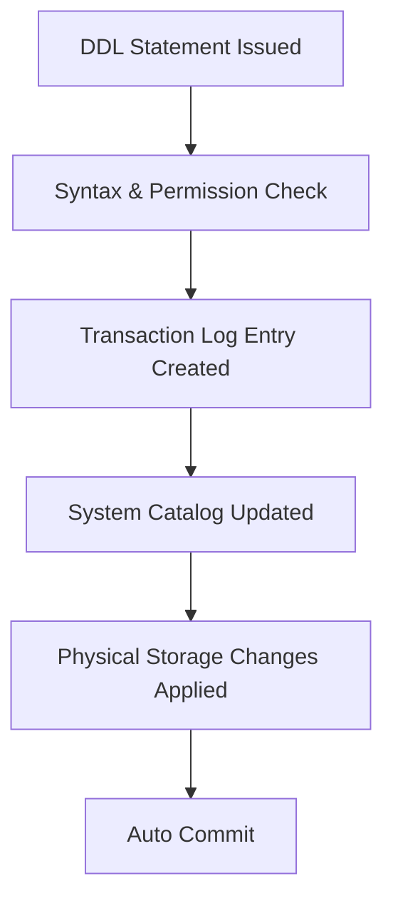

## DDL (Data Definition Language) in T-SQL

**Data Definition Language (DDL)** is the subset of **T-SQL** used to define, modify, and manage database schema objects such as databases, tables, views, indexes, constraints, triggers, and schemas. DDL operations change metadata and are **auto-committed**, meaning they cannot be rolled back once executed.

---

### Core Role of DDL

* Defines **database structures** (e.g., databases, tables, indexes).
* Modifies **existing structures** (e.g., adding or altering columns).
* Removes **schema objects** (e.g., dropping a table or view).
* Maintains **data integrity** through constraints.
* Establishes **relationships** among objects (e.g., foreign keys).

---

### Major DDL Commands

| Command    | Description                                                     |
| ---------- | --------------------------------------------------------------- |
| `CREATE`   | Creates new database objects (tables, views, schemas, indexes). |
| `ALTER`    | Modifies existing database objects.                             |
| `DROP`     | Permanently deletes database objects.                           |
| `TRUNCATE` | Removes all data from a table, resetting storage.               |
| `RENAME`   | Changes the name of a database object (via `sp_rename`).        |

---

### `CREATE` Command

Used to define new database objects.

#### Syntax (Common Forms)

```sql
CREATE DATABASE database_name;

CREATE TABLE table_name (
    column_name data_type [NULL | NOT NULL],
    ...
    [CONSTRAINT constraint_name constraint_type]
);

CREATE VIEW view_name AS
SELECT columns FROM tables WHERE condition;

CREATE INDEX index_name ON table_name(column_name);

CREATE SCHEMA schema_name AUTHORIZATION owner_name;
```

#### Notes

* A `CREATE` statement registers the object in system catalogs.
* `CREATE TABLE` supports constraints such as **PRIMARY KEY**, **FOREIGN KEY**, **CHECK**, **UNIQUE**, and **DEFAULT**.

Example:

```sql
CREATE TABLE Employees (
    EmpID INT PRIMARY KEY,
    Name NVARCHAR(50) NOT NULL,
    Salary DECIMAL(10,2) CHECK (Salary > 0),
    DeptID INT FOREIGN KEY REFERENCES Departments(DeptID)
);
```

---

### `ALTER` Command

Modifies an existing object without dropping it.

#### Syntax

```sql
ALTER TABLE table_name
ADD new_column data_type [NULL | NOT NULL];

ALTER TABLE table_name
ALTER COLUMN column_name new_data_type;

ALTER TABLE table_name
DROP COLUMN column_name;

ALTER DATABASE database_name
MODIFY NAME = new_name;
```

#### Notes

* Preserves existing data unless a structural conflict occurs.
* You can **add**, **modify**, or **drop** constraints, indexes, and columns.

Example:

```sql
ALTER TABLE Employees
ADD HireDate DATE DEFAULT GETDATE();
```

---

### `DROP` Command

Removes objects permanently from the database.

#### Syntax

```sql
DROP DATABASE database_name;
DROP TABLE table_name;
DROP VIEW view_name;
DROP INDEX index_name ON table_name;
DROP SCHEMA schema_name;
```

#### Notes

* Removes both structure and data.
* Cascades to dependent objects if constraints or references exist (if supported).
* Cannot be rolled back once executed.

Example:

```sql
DROP TABLE Employees;
```

---

### `TRUNCATE` Command

Removes all rows from a table quickly without logging each row deletion.

#### Syntax

```sql
TRUNCATE TABLE table_name;
```

#### Comparison with `DELETE`

| Aspect         | `TRUNCATE`                          | `DELETE`     |
| -------------- | ----------------------------------- | ------------ |
| Logging        | Minimal                             | Fully logged |
| WHERE clause   | Not allowed                         | Allowed      |
| Identity reset | Yes                                 | No           |
| Triggers       | Not fired                           | Fired        |
| Rollback       | Only if within explicit transaction | Yes          |

Example:

```sql
TRUNCATE TABLE Employees;
```

---

### `RENAME` (via Stored Procedure)

T-SQL does not have a direct `RENAME` keyword. Use **`sp_rename`** system procedure.

#### Syntax

```sql
EXEC sp_rename 'old_name', 'new_name', 'OBJECT';
```

Example:

```sql
EXEC sp_rename 'Employees', 'Staff', 'OBJECT';
```

---

### Constraints in DDL

Constraints are part of DDL and maintain **data integrity**.

| Constraint      | Purpose                                        |
| --------------- | ---------------------------------------------- |
| **PRIMARY KEY** | Uniquely identifies each record.               |
| **FOREIGN KEY** | Enforces referential integrity between tables. |
| **UNIQUE**      | Ensures unique values in a column.             |
| **CHECK**       | Validates values based on a condition.         |
| **DEFAULT**     | Assigns a default value if none is provided.   |
| **NOT NULL**    | Prevents null values.                          |

Example:

```sql
CREATE TABLE Orders (
    OrderID INT PRIMARY KEY,
    OrderDate DATE DEFAULT GETDATE(),
    Amount DECIMAL(10,2) CHECK (Amount > 0)
);
```

---

### Schema Management

* **Schemas** logically group database objects.
* Allow multiple users or applications to isolate data.

Example:

```sql
CREATE SCHEMA HR AUTHORIZATION dbo;
CREATE TABLE HR.Employees (EmpID INT PRIMARY KEY, Name NVARCHAR(50));
```

---

### System Catalog Updates

Every DDL command updates **system tables** such as:

* `sys.objects` — stores object metadata
* `sys.tables`, `sys.columns`, `sys.schemas`, etc.

DDL statements also trigger **system versioning**, **transaction logs**, and **cache invalidation** internally.

---

### Diagram: DDL Operation Lifecycle



---

### Key Considerations

* DDL changes cannot be undone once committed.
* Always verify dependencies before dropping objects.
* Use `INFORMATION_SCHEMA` views to inspect schema definitions.
* DDL triggers (`AFTER CREATE`, `ALTER`, `DROP`) can enforce governance.

Example of a DDL Trigger:

```sql
CREATE TRIGGER PreventDropTable
ON DATABASE
FOR DROP_TABLE
AS
BEGIN
    PRINT 'Dropping tables is not allowed!';
    ROLLBACK;
END;
```

---
