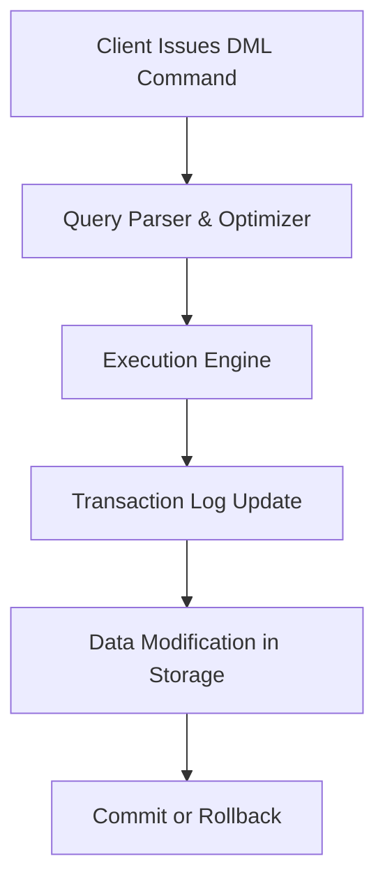

## DML (Data Manipulation Language) in T-SQL

**Data Manipulation Language (DML)** in **T-SQL** manages the **data stored inside database objects** such as tables and views. Unlike DDL (which defines structure), DML focuses on **retrieving, inserting, updating, and deleting** data. DML operations can be **rolled back or committed** as part of transactions, supporting **ACID compliance**.

---

### Core Role of DML

* Manages actual data, not schema.
* Enables CRUD operations: **Create, Read, Update, Delete**.
* Executes within transactions to ensure data integrity.
* Supports set-based and procedural data handling.

---

### Primary DML Commands

| Command  | Purpose                                                       |
| -------- | ------------------------------------------------------------- |
| `SELECT` | Retrieves data from tables or views.                          |
| `INSERT` | Adds new records.                                             |
| `UPDATE` | Modifies existing records.                                    |
| `DELETE` | Removes specific records.                                     |
| `MERGE`  | Performs insert, update, or delete in one statement (UPSERT). |

---

### `SELECT` Statement

Retrieves and displays data.

#### Syntax

```sql
SELECT [TOP (n)] [DISTINCT] column_list
FROM table_name
[WHERE condition]
[GROUP BY column_list]
[HAVING condition]
[ORDER BY column_list [ASC|DESC]];
```

#### Clauses Explained

| Clause     | Description                               |
| ---------- | ----------------------------------------- |
| `FROM`     | Specifies table(s) or view(s).            |
| `WHERE`    | Filters rows based on condition.          |
| `GROUP BY` | Groups rows to apply aggregate functions. |
| `HAVING`   | Filters grouped results.                  |
| `ORDER BY` | Sorts output rows.                        |

Example:

```sql
SELECT DeptID, AVG(Salary) AS AvgSalary
FROM Employees
WHERE Salary > 50000
GROUP BY DeptID
HAVING AVG(Salary) > 60000
ORDER BY AvgSalary DESC;
```

---

### `INSERT` Statement

Adds new data rows to a table.

#### Syntax

```sql
INSERT INTO table_name (column1, column2, ...)
VALUES (value1, value2, ...);

-- Or insert from another table
INSERT INTO table_name (column1, column2, ...)
SELECT column1, column2 FROM other_table WHERE condition;
```

Example:

```sql
INSERT INTO Employees (EmpID, Name, Salary, DeptID)
VALUES (101, 'John', 60000, 3);
```

#### Notes

* Data type and order must match column definitions.
* Use `DEFAULT` for default values and `NULL` for unknowns.
* Identity columns can be explicitly inserted using `SET IDENTITY_INSERT ON`.

---

### `UPDATE` Statement

Modifies existing data in one or more rows.

#### Syntax

```sql
UPDATE table_name
SET column1 = value1, column2 = value2, ...
WHERE condition;
```

Example:

```sql
UPDATE Employees
SET Salary = Salary * 1.10
WHERE DeptID = 2;
```

#### Notes

* Omit `WHERE` → updates all rows (risky).
* You can reference subqueries or joins for complex updates.

Example using subquery:

```sql
UPDATE E
SET E.Salary = E.Salary + 1000
FROM Employees E
JOIN Departments D ON E.DeptID = D.DeptID
WHERE D.Name = 'Sales';
```

---

### `DELETE` Statement

Removes data from a table.

#### Syntax

```sql
DELETE FROM table_name
WHERE condition;
```

Example:

```sql
DELETE FROM Employees WHERE EmpID = 105;
```

#### Notes

* Logs every deleted row (fully logged).
* Can be rolled back if within a transaction.
* Use `TRUNCATE` for fast, full-table deletion.

---

### `MERGE` Statement

Combines insert, update, and delete into one operation (UPSERT logic).

#### Syntax

```sql
MERGE target_table AS T
USING source_table AS S
ON T.key = S.key
WHEN MATCHED THEN
    UPDATE SET T.col = S.col
WHEN NOT MATCHED BY TARGET THEN
    INSERT (col1, col2) VALUES (S.col1, S.col2)
WHEN NOT MATCHED BY SOURCE THEN
    DELETE;
```

Example:

```sql
MERGE Employees AS T
USING NewEmployees AS S
ON T.EmpID = S.EmpID
WHEN MATCHED THEN
    UPDATE SET T.Salary = S.Salary
WHEN NOT MATCHED BY TARGET THEN
    INSERT (EmpID, Name, Salary) VALUES (S.EmpID, S.Name, S.Salary)
WHEN NOT MATCHED BY SOURCE THEN
    DELETE;
```

---

### Transactions in DML

All DML operations can participate in transactions to ensure atomicity.

```sql
BEGIN TRANSACTION;

UPDATE Accounts SET Balance = Balance - 500 WHERE AccID = 101;
UPDATE Accounts SET Balance = Balance + 500 WHERE AccID = 102;

IF @@ERROR <> 0
    ROLLBACK TRANSACTION;
ELSE
    COMMIT TRANSACTION;
```

| Operation           | Result                       |
| ------------------- | ---------------------------- |
| `BEGIN TRANSACTION` | Starts a transaction.        |
| `COMMIT`            | Makes all changes permanent. |
| `ROLLBACK`          | Reverses all changes.        |

---

### Triggers (DML Triggers)

Special procedures automatically executed on DML events.

| Type           | Triggered By                 | Description                                |
| -------------- | ---------------------------- | ------------------------------------------ |
| **AFTER**      | `INSERT`, `UPDATE`, `DELETE` | Fires after modification completes.        |
| **INSTEAD OF** | `INSERT`, `UPDATE`, `DELETE` | Replaces default action with custom logic. |

Example:

```sql
CREATE TRIGGER trg_AfterInsert
ON Employees
AFTER INSERT
AS
BEGIN
    PRINT 'Record inserted into Employees table';
END;
```

---

### DML Execution Flow Diagram



---

### Key Considerations

* Always include a `WHERE` clause in `UPDATE`/`DELETE` unless full modification is intentional.
* Prefer **set-based operations** over **cursors** for performance.
* Use **transactions** to maintain consistency in multi-step changes.
* Avoid using `MERGE` for concurrent-heavy systems unless necessary (can cause race conditions).
* Monitor **`@@ROWCOUNT`** after DML execution for affected rows.

---
