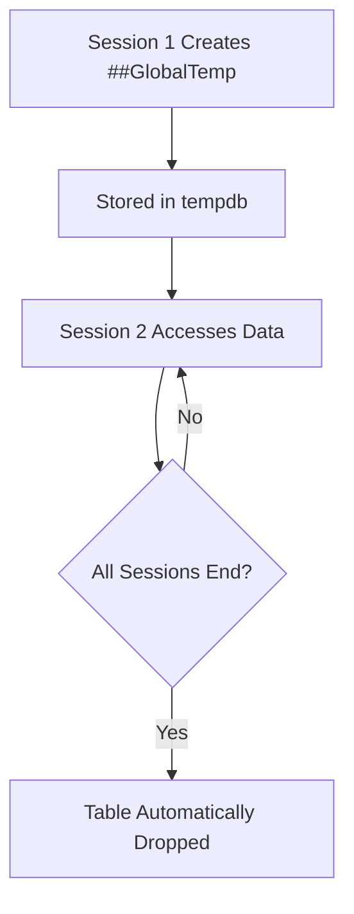

## **Global Temporary Tables (`##`) in MS SQL Server**

---

### **Overview**

A **Global Temporary Table** (prefixed with `##`) is a temporary table stored in the **tempdb** database that is **accessible to all sessions** (connections) until the session that created it ends **and** all other sessions referencing it have also completed.

Unlike **local temporary tables (`#`)**, global temporary tables have a **global scope**.

---

### **Characteristics**

* Name starts with **two hashes** (`##`), e.g., `##GlobalTemp`.
* Created in **tempdb** like all temporary tables.
* **Visible to all sessions** and connections.
* **Automatically dropped** when:

  * The session that created it **ends**, and
  * **No other sessions** are actively using it.
* Can be used for **inter-session data sharing** (e.g., between stored procedures or applications).
* Behaves like a **permanent table** while it exists.

---

### **Syntax**

#### **Creating a Global Temporary Table**

```sql
CREATE TABLE ##GlobalTemp (
    ID INT PRIMARY KEY,
    Name NVARCHAR(100),
    Quantity INT
);
```

#### **Inserting Data**

```sql
INSERT INTO ##GlobalTemp VALUES (1, 'Pen', 10), (2, 'Book', 5);
```

#### **Selecting Data (from any session)**

```sql
SELECT * FROM ##GlobalTemp;
```

#### **Dropping the Table**

```sql
DROP TABLE ##GlobalTemp;
```

*(Automatically dropped when creator session ends and no users reference it.)*

---

### **Scope and Lifetime**

| Context                | Behavior                                             |
| ---------------------- | ---------------------------------------------------- |
| **Creator session**    | Has immediate access                                 |
| **Other sessions**     | Can access while the creator session is active       |
| **After creator ends** | Stays alive **until all sessions using it are done** |
| **Across users**       | Shared globally until no active reference            |

---

#### **Example**

**Session 1**

```sql
CREATE TABLE ##GlobalTemp (ID INT);
INSERT INTO ##GlobalTemp VALUES (101);
```

**Session 2**

```sql
SELECT * FROM ##GlobalTemp;
```

**Result:**
Session 2 can access the same data until Session 1 ends and no one else is using it.

---

### **System Metadata**

Global temporary tables are stored in:

```sql
SELECT * FROM tempdb.sys.tables WHERE name LIKE '##%';
```

They are renamed internally with a unique suffix, e.g.,
`##GlobalTemp____________________________________________0000000003`.

---

### **Performance Aspects**

* Stored in **tempdb** — uses memory and disk as needed.
* Can have **indexes**, **constraints**, and **triggers**.
* Performs comparably to **permanent tables** during active use.
* Slightly slower to create/drop due to **shared access synchronization**.

---

### **Differences Between Local and Global Temporary Tables**

| Feature             | Local Temporary Table (`#`)        | Global Temporary Table (`##`)              |
| ------------------- | ---------------------------------- | ------------------------------------------ |
| **Scope**           | Current session or procedure       | All sessions                               |
| **Visibility**      | Private to one session             | Public to all sessions                     |
| **Lifetime**        | Ends when session/procedure ends   | Ends when creator and all users disconnect |
| **Use case**        | Session-specific intermediate data | Data sharing between sessions              |
| **Name prefix**     | `#`                                | `##`                                       |
| **Creation impact** | Lightweight                        | Slightly heavier (synchronization)         |
| **Security**        | Safer (session-isolated)           | Risk of name collision or data exposure    |

---

### **Advantages**

* Enables **cross-session data sharing**.
* Useful for **multi-step batch processes** or **ETL workflows**.
* Supports all **T-SQL features** (indexes, triggers, constraints).
* Automatically cleaned up — no manual maintenance.

---

### **Limitations**

* Visible to **all users**, which can lead to **data conflicts**.
* Risk of **naming collisions** if multiple sessions create tables with the same name.
* Stored in **tempdb**, which may impact performance under high load.
* Should **not be used for sensitive data**.

---

### **Best Practices**

* Use global temp tables only when **explicit data sharing** between sessions is required.
* Always **drop explicitly** once no longer needed:

  ```sql
  DROP TABLE ##GlobalTemp;
  ```
* Use **unique names** to avoid collisions:

  ```sql
  CREATE TABLE ##GlobalTemp_20251024 (...);
  ```
* Avoid use in **concurrent environments** unless synchronization is handled.

---

### **Mermaid Diagram**



---
