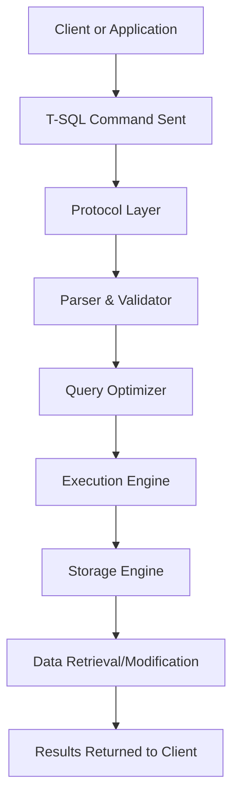

## T-SQL Language Fundamentals

**Transact-SQL (T-SQL)** is Microsoft’s extension of the **ANSI SQL standard**, designed to work within **Microsoft SQL Server** and **Azure SQL Database**. It adds procedural logic, transaction control, error handling, and system functions to standard SQL, allowing both **data manipulation** and **server-side programming** in a unified syntax.

---

### Nature and Role of T-SQL

* **Declarative + Procedural Language**
  Combines SQL’s *set-based declarative model* (what data to fetch) with procedural programming (how to process data).
* **Server-Side Execution**
  T-SQL executes directly within the SQL Server engine, reducing client-server communication.
* **Integration Layer**
  Enables defining schema, managing data, handling transactions, controlling security, and automating operations.

---

### Basic Syntax Structure

A T-SQL script consists of **statements**, **batches**, **blocks**, and **comments**.

| Component     | Description                                                         |
| ------------- | ------------------------------------------------------------------- |
| **Statement** | Individual SQL command (e.g., `SELECT`, `INSERT`, `UPDATE`).        |
| **Batch**     | Group of statements sent together for execution, separated by `GO`. |
| **Block**     | Logical grouping using `BEGIN...END`.                               |
| **Comment**   | `--` for single line, `/* ... */` for multi-line comments.          |

Example:

```sql
BEGIN
    SELECT name, salary FROM Employees;
END;
GO  -- batch separator
```

---

### Data Types

T-SQL supports rich data types categorized as:

| Category        | Examples                                                                     |
| --------------- | ---------------------------------------------------------------------------- |
| **Numeric**     | `INT`, `BIGINT`, `SMALLINT`, `TINYINT`, `DECIMAL`, `FLOAT`, `REAL`, `MONEY`  |
| **Character**   | `CHAR`, `VARCHAR`, `TEXT`, `NCHAR`, `NVARCHAR`, `NTEXT`                      |
| **Date & Time** | `DATE`, `DATETIME`, `DATETIME2`, `SMALLDATETIME`, `TIME`                     |
| **Binary**      | `BINARY`, `VARBINARY`, `IMAGE`                                               |
| **Bit**         | `BIT` (Boolean-like)                                                         |
| **Other**       | `XML`, `JSON`, `UNIQUEIDENTIFIER`, `SQL_VARIANT`, `GEOGRAPHY`, `HIERARCHYID` |

---

### Variables

Variables in T-SQL store temporary data during execution.

```sql
DECLARE @count INT = 0;
SET @count = @count + 1;
PRINT @count;
```

| Command   | Description                                       |
| --------- | ------------------------------------------------- |
| `DECLARE` | Defines a variable.                               |
| `SET`     | Assigns a value.                                  |
| `SELECT`  | Can also assign values to variables from queries. |

---

### Operators

| Type                     | Examples                        |             |
| ------------------------ | ------------------------------- | ----------- |
| **Arithmetic**           | `+`, `-`, `*`, `/`, `%`         |             |
| **Comparison**           | `=`, `>`, `<`, `>=`, `<=`, `<>` |             |
| **Logical**              | `AND`, `OR`, `NOT`              |             |
| **Bitwise**              | `&`, `                          | `, `^`, `~` |
| **Assignment**           | `=`                             |             |
| **String Concatenation** | `+`                             |             |

---

### Expressions

* Combine literals, variables, and functions into a computed value.
* Used in `SELECT`, `WHERE`, `HAVING`, and computed columns.

```sql
SELECT FirstName + ' ' + LastName AS FullName, Salary * 1.10 AS Bonus FROM Employees;
```

---

### Control-of-Flow Elements

Provide procedural logic inside T-SQL scripts.

| Construct            | Usage                            |
| -------------------- | -------------------------------- |
| `BEGIN...END`        | Groups statements.               |
| `IF...ELSE`          | Conditional branching.           |
| `WHILE`              | Iterative looping.               |
| `BREAK` / `CONTINUE` | Loop control.                    |
| `RETURN`             | Exit from procedure or function. |
| `GOTO`               | Jump to labeled statement.       |
| `WAITFOR`            | Delay or schedule execution.     |

Example:

```sql
DECLARE @i INT = 1;
WHILE @i <= 5
BEGIN
    PRINT 'Count = ' + CAST(@i AS VARCHAR);
    SET @i = @i + 1;
END;
```

---

### Built-in Functions

T-SQL includes **scalar** and **aggregate** functions.

| Category         | Common Functions                                          |
| ---------------- | --------------------------------------------------------- |
| **Aggregate**    | `SUM()`, `AVG()`, `COUNT()`, `MIN()`, `MAX()`             |
| **String**       | `LEN()`, `SUBSTRING()`, `REPLACE()`, `LTRIM()`, `RTRIM()` |
| **Date & Time**  | `GETDATE()`, `DATEADD()`, `DATEDIFF()`, `YEAR()`          |
| **Mathematical** | `ABS()`, `ROUND()`, `POWER()`, `RAND()`                   |
| **Conversion**   | `CAST()`, `CONVERT()`                                     |
| **System**       | `@@ROWCOUNT`, `@@ERROR`, `SCOPE_IDENTITY()`               |

---

### NULL Handling

* `NULL` represents missing or unknown data.
* Use **IS NULL** and **IS NOT NULL** for comparisons.
* Use **ISNULL(expr, replacement)** or **COALESCE(expr1, expr2, …)** to handle nulls.

```sql
SELECT ISNULL(Bonus, 0) FROM Employees;
```

---

### Statements Classification

| Category                               | Description                                              |
| -------------------------------------- | -------------------------------------------------------- |
| **DDL (Data Definition Language)**     | Define structure: `CREATE`, `ALTER`, `DROP`, `TRUNCATE`. |
| **DML (Data Manipulation Language)**   | Handle data: `SELECT`, `INSERT`, `UPDATE`, `DELETE`.     |
| **DCL (Data Control Language)**        | Manage access: `GRANT`, `REVOKE`, `DENY`.                |
| **TCL (Transaction Control Language)** | Control transactions: `BEGIN`, `COMMIT`, `ROLLBACK`.     |

---

### Transactions

Ensure ACID compliance in data modifications.

```sql
BEGIN TRANSACTION;
UPDATE Accounts SET Balance = Balance - 100 WHERE Id = 1;
UPDATE Accounts SET Balance = Balance + 100 WHERE Id = 2;
COMMIT TRANSACTION;
```

* Use `ROLLBACK` to undo changes if errors occur.
* Use `@@TRANCOUNT` to check open transactions.

---

### Error Handling

T-SQL provides structured and traditional error handling mechanisms.

```sql
BEGIN TRY
    UPDATE Orders SET Status = 'Shipped' WHERE OrderID = 10;
END TRY
BEGIN CATCH
    PRINT ERROR_MESSAGE();
END CATCH;
```

| Function           | Purpose                       |
| ------------------ | ----------------------------- |
| `ERROR_MESSAGE()`  | Returns error message.        |
| `ERROR_NUMBER()`   | Returns error code.           |
| `ERROR_LINE()`     | Returns line number of error. |
| `ERROR_SEVERITY()` | Returns error severity level. |

---

### Batches and Scope

* **Batch**: Group of T-SQL statements sent together to SQL Server.
* **Scope**: Lifetime of declared variables and temporary objects.
* Variables declared in one batch are not visible in another.

---

### Comments and Documentation

| Type        | Syntax          |
| ----------- | --------------- |
| Single-line | `-- comment`    |
| Multi-line  | `/* comment */` |

---

### Execution Environment

| Tool                  | Purpose                              |
| --------------------- | ------------------------------------ |
| **SSMS**              | Graphical management and query tool. |
| **sqlcmd**            | Command-line execution of T-SQL.     |
| **Azure Data Studio** | Cross-platform SQL client.           |

---

### Key Concepts to Remember

* Every statement ends with a semicolon (`;`) in best practice.
* Batches are separated by `GO` (not part of SQL standard).
* Use `SET NOCOUNT ON` in procedures to reduce network overhead.
* Prefer **set-based operations** over cursors for performance.

---

### Diagram: T-SQL Execution Flow



---
