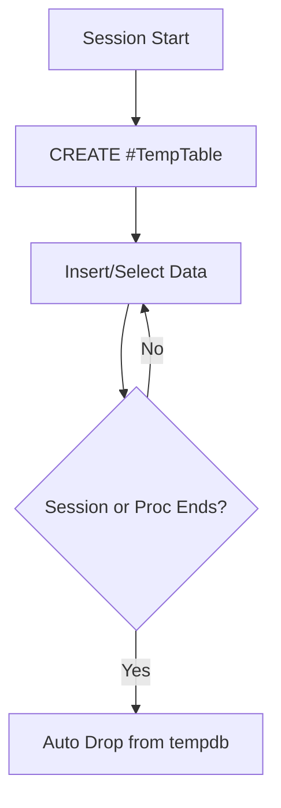

## **Local Temporary Tables (`#`) in MS SQL Server**

---

### **Overview**

A **Local Temporary Table** (prefixed with `#`) is a **session-specific table** created in the **tempdb** database. It stores temporary data that exists **only for the duration of the user session or procedure** in which it was created. Once the session ends, the table is automatically dropped.

---

### **Characteristics**

* Name begins with a single hash (`#`) — e.g., `#TempSales`.
* Visible **only to the session** that created it.
* Automatically stored in **tempdb**, not the user database.
* Automatically **deleted** when:

  * The session ends, or
  * The creating stored procedure finishes (if declared inside one).
* Can contain **indexes**, **constraints**, and **triggers** like regular tables.

---

### **Syntax**

#### **Creating a Local Temporary Table**

```sql
CREATE TABLE #TempTable (
    ID INT PRIMARY KEY,
    Name NVARCHAR(100),
    Amount DECIMAL(10, 2)
);
```

#### **Inserting Data**

```sql
INSERT INTO #TempTable VALUES (1, 'Alice', 100.50);
INSERT INTO #TempTable VALUES (2, 'Bob', 200.75);
```

#### **Selecting Data**

```sql
SELECT * FROM #TempTable;
```

#### **Dropping the Table**

```sql
DROP TABLE #TempTable;
```

*(Optional — SQL Server drops it automatically at session end.)*

---

### **Scope**

| Context                       | Availability                            |
| ----------------------------- | --------------------------------------- |
| **Within a session**          | Visible only to that connection         |
| **Inside a stored procedure** | Visible only within that procedure      |
| **Nested stored procedures**  | Available if created in outer procedure |
| **Across sessions**           | Not visible                             |

---

### **Behavior in Stored Procedures**

When created inside a stored procedure:

* It is **destroyed automatically** when the procedure ends.
* A **new instance** is created if the procedure is called again.
* Cannot be shared between different procedure executions.

Example:

```sql
CREATE PROCEDURE TestProc AS
BEGIN
    CREATE TABLE #ProcTemp (ID INT);
    INSERT INTO #ProcTemp VALUES (1);
    SELECT * FROM #ProcTemp;
END;
```

---

### **Performance Aspects**

* Stored in **tempdb**, so uses disk I/O if data is large.
* Supports **statistics** and **indexing**, improving performance for complex joins.
* SQL Server may **recompile** queries when temp tables are created or dropped.
* Generally **faster** than table variables for moderate-to-large data volumes.

---

### **Differences Between Temporary and Permanent Tables**

| Feature             | Temporary Table (`#`)          | Permanent Table         |
| ------------------- | ------------------------------ | ----------------------- |
| Storage Location    | `tempdb`                       | User-defined database   |
| Scope               | Session or procedure           | Permanent               |
| Lifetime            | Until session/procedure ends   | Until dropped manually  |
| Naming              | `#Temp`                        | `TableName`             |
| Persistence         | Auto-deleted                   | Manual drop             |
| Indexes/Constraints | Supported                      | Supported               |
| Usage               | Temporary/intermediate storage | Persistent data storage |

---

### **System Metadata**

Temporary tables are stored under:

```sql
SELECT * FROM tempdb.sys.tables;
```

Their actual internal name is prefixed by session identifiers (e.g., `#TempTable________________________________________0000000001`).

---

### **Advantages**

* Simplifies handling of **intermediate results**.
* Reduces **locking and contention** in permanent tables.
* Provides **flexible schema** for temporary transformations.
* Automatically **cleans up**, requiring no manual maintenance.

---

### **Limitations**

* Cannot be **shared across sessions**.
* Excessive use can **consume tempdb resources**.
* May cause **recompilation overhead** in stored procedures.
* Slower than **table variables** for very small datasets.

---

### **Best Practices**

* Use local temp tables for **complex joins** or **large datasets**.
* Prefer **table variables** (`@Table`) for **small data sets**.
* Always drop explicitly if the session persists long.
* Avoid creating inside **loops** to reduce recompilation.

---

### **Mermaid Diagram**



---
