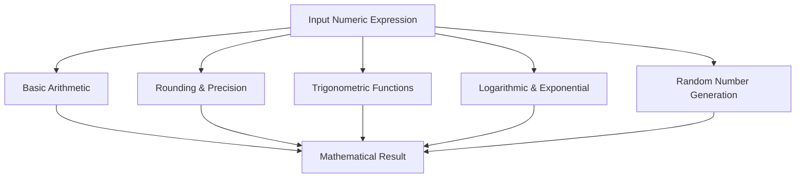

## Mathematical Functions in T-SQL

**Mathematical functions** in T-SQL perform arithmetic, trigonometric, logarithmic, and rounding operations on numeric expressions.
They help manipulate numerical data for statistical, financial, and engineering computations.

---

### Categories of Mathematical Functions

| Category                  | Description                              | Examples                               |
| ------------------------- | ---------------------------------------- | -------------------------------------- |
| Basic Arithmetic          | Basic numeric operations                 | `ABS()`, `SIGN()`, `POWER()`, `SQRT()` |
| Rounding & Precision      | Round or truncate numbers                | `ROUND()`, `CEILING()`, `FLOOR()`      |
| Logarithmic & Exponential | Logarithmic and exponential calculations | `LOG()`, `LOG10()`, `EXP()`            |
| Trigonometric             | Angle-based calculations                 | `SIN()`, `COS()`, `TAN()`, `ASIN()`    |
| Random & Numeric Control  | Generate or manage random numbers        | `RAND()`, `PI()`                       |
| Remainder & Conversion    | Return remainders or conversions         | `SQUARE()`, `DEGREES()`, `RADIANS()`   |

---

### 1. Basic Arithmetic Functions

| Function           | Description                  | Example               | Output             |
| ------------------ | ---------------------------- | --------------------- | ------------------ |
| **ABS(number)**    | Returns absolute value       | `SELECT ABS(-42);`    | `42`               |
| **SIGN(number)**   | Returns sign: `-1`, `0`, `1` | `SELECT SIGN(-15);`   | `-1`               |
| **POWER(x, y)**    | Returns $x^y$                | `SELECT POWER(2, 3);` | `8`                |
| **SQRT(number)**   | Square root                  | `SELECT SQRT(25);`    | `5`                |
| **SQUARE(number)** | Returns square of number     | `SELECT SQUARE(4);`   | `16`               |
| **PI()**           | Returns π constant           | `SELECT PI();`        | `3.14159265358979` |

---

### 2. Rounding and Precision Functions

| Function                                  | Description                                               | Example                        | Output   |
| ----------------------------------------- | --------------------------------------------------------- | ------------------------------ | -------- |
| **ROUND(number, decimals [, operation])** | Rounds number to `decimals`; optional operation truncates | `SELECT ROUND(123.456, 2);`    | `123.46` |
|                                           | Truncate instead of round                                 | `SELECT ROUND(123.456, 2, 1);` | `123.45` |
| **CEILING(number)**                       | Rounds up to next integer                                 | `SELECT CEILING(4.2);`         | `5`      |
| **FLOOR(number)**                         | Rounds down to previous integer                           | `SELECT FLOOR(4.8);`           | `4`      |

---

### 3. Logarithmic and Exponential Functions

| Function                 | Description                           | Example                | Output        |
| ------------------------ | ------------------------------------- | ---------------------- | ------------- |
| **LOG(number [, base])** | Natural log (base e) or log with base | `SELECT LOG(10);`      | `2.302585`    |
|                          | Base 10 example                       | `SELECT LOG(100, 10);` | `2`           |
| **LOG10(number)**        | Base 10 log                           | `SELECT LOG10(1000);`  | `3`           |
| **EXP(number)**          | Exponential function $e^x$            | `SELECT EXP(1);`       | `2.718281828` |

---

### 4. Trigonometric Functions

| Function         | Description                                | Example               | Output   |
| ---------------- | ------------------------------------------ | --------------------- | -------- |
| **SIN(angle)**   | Returns sine of angle (radians)            | `SELECT SIN(PI()/2);` | `1`      |
| **COS(angle)**   | Cosine of angle                            | `SELECT COS(0);`      | `1`      |
| **TAN(angle)**   | Tangent of angle                           | `SELECT TAN(PI()/4);` | `1`      |
| **ASIN(number)** | Inverse sine                               | `SELECT ASIN(1);`     | `1.5708` |
| **ACOS(number)** | Inverse cosine                             | `SELECT ACOS(0);`     | `1.5708` |
| **ATAN(number)** | Inverse tangent                            | `SELECT ATAN(1);`     | `0.7854` |
| **ATN2(y, x)**   | Arc tangent of `y/x`, considering quadrant | `SELECT ATN2(1, 1);`  | `0.7854` |

---

### 5. Angle Conversion Functions

| Function             | Description                | Example                 | Output   |
| -------------------- | -------------------------- | ----------------------- | -------- |
| **DEGREES(radians)** | Converts radians → degrees | `SELECT DEGREES(PI());` | `180`    |
| **RADIANS(degrees)** | Converts degrees → radians | `SELECT RADIANS(180);`  | `3.1416` |

---

### 6. Random Number and Remainder Functions

| Function                    | Description                                                   | Example               | Output   |
| --------------------------- | ------------------------------------------------------------- | --------------------- | -------- |
| **RAND([seed])**            | Returns random float between 0 and 1; deterministic with seed | `SELECT RAND();`      | `0.7146` |
|                             | Fixed seed example                                            | `SELECT RAND(100);`   | `0.715`  |
| **RAND()*n**                | Random float between 0 and n                                  | `SELECT RAND() * 10;` | `7.52`   |
| **MODULO using % operator** | Remainder of division                                         | `SELECT 10 % 3;`      | `1`      |

---

### 7. Advanced Mathematical Functions

| Function           | Description              | Example               | Output     |
| ------------------ | ------------------------ | --------------------- | ---------- |
| **EXP(number)**    | $e^x$                    | `SELECT EXP(2);`      | `7.389056` |
| **LOG(), LOG10()** | Logarithmic base e or 10 | `SELECT LOG(64, 2);`  | `6`        |
| **POWER()**        | Raise number to power    | `SELECT POWER(3, 4);` | `81`       |
| **SQRT()**         | Square root              | `SELECT SQRT(81);`    | `9`        |
| **SQUARE()**       | Square of number         | `SELECT SQUARE(5);`   | `25`       |

---

### 8. Combined Mathematical Operations

```sql
SELECT 
    ABS(-10) AS AbsoluteValue,
    ROUND(PI(), 3) AS RoundedPi,
    POWER(SIN(RADIANS(30)), 2) AS SineSquared,
    FLOOR(RAND() * 100) AS RandomInt;
```

---

### 9. Mathematical Constants

| Constant           | Function | Value              |
| ------------------ | -------- | ------------------ |
| π (pi)             | `PI()`   | `3.14159265358979` |
| e (Euler’s number) | `EXP(1)` | `2.71828182845905` |

---

### 10. Concept Diagram



---

### 11. Usage Scenarios

| Scenario               | Example                                               |
| ---------------------- | ----------------------------------------------------- |
| Financial calculations | Rounding currency values using `ROUND()`              |
| Engineering analysis   | Trigonometric computation for angles                  |
| Data analytics         | Normalization and scaling using `LOG()` and `POWER()` |
| Randomized sampling    | Generating test data with `RAND()`                    |
| Reporting              | Ceiling or floor rounding for summaries               |

---

### 12. Best Practices

* Use **`ROUND()`** for monetary values, not `CAST()` to integer (to avoid truncation errors).
* Use **`RAND(seed)`** only when deterministic sequences are required; otherwise, seedless for randomness.
* Prefer **`DEGREES()`** and **`RADIANS()`** to ensure clarity in trigonometric conversions.
* Combine **`ABS()`**, **`SIGN()`**, and **`POWER()`** for advanced numeric models.
* Use **`FLOAT`** or **`DECIMAL`** types for precision control in complex calculations.

---
