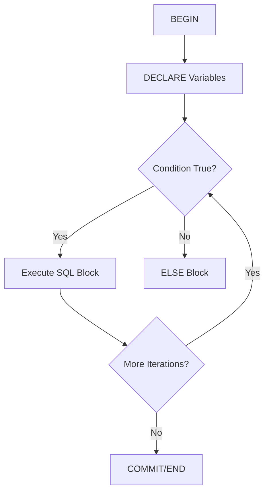

## Procedural Constructs in T-SQL

**Procedural Constructs** in **Transact-SQL (T-SQL)** extend SQL’s declarative nature by introducing **control-of-flow**, **branching**, **looping**, and **modular programming** capabilities. These constructs make T-SQL a **procedural language**, enabling developers to write complex business logic directly inside SQL Server.

---

### Purpose

* Enable conditional execution of SQL statements.
* Support iteration, decision-making, and exception handling.
* Allow modular and reusable database programming using procedures and functions.
* Facilitate fine-grained control within stored programs, triggers, and scripts.

---

### Major Categories of Procedural Constructs

| Category                           | Description                                                                |
| ---------------------------------- | -------------------------------------------------------------------------- |
| **Control-of-Flow Statements**     | Control execution order of statements (IF, WHILE, etc.).                   |
| **Branching Constructs**           | Perform conditional branching (IF...ELSE, CASE).                           |
| **Looping Constructs**             | Repeat operations (WHILE).                                                 |
| **Exception Handling**             | Handle runtime errors (TRY...CATCH).                                       |
| **Modular Programming**            | Encapsulate logic into blocks (BEGIN...END, Stored Procedures, Functions). |
| **Variable and Cursor Management** | Declare and manipulate data programmatically.                              |

---

### Variable Declaration and Assignment

#### Syntax

```sql
DECLARE @variable_name data_type [= initial_value];
SET @variable_name = value;
```

Example:

```sql
DECLARE @count INT = 5;
SET @count = @count + 1;
```

---

### BEGIN...END Block

Used to group multiple statements into a single logical block.

```sql
BEGIN
    PRINT 'Start of block';
    UPDATE Employees SET Salary += 1000 WHERE Dept = 'HR';
END;
```

---

### Conditional Branching

#### IF...ELSE

Executes statements based on a condition.

```sql
IF (SELECT COUNT(*) FROM Orders WHERE Status='Pending') > 10
    PRINT 'Too many pending orders';
ELSE
    PRINT 'Order load normal';
```

---

#### CASE Expression

Used for inline conditional evaluation.

```sql
SELECT 
    EmpID,
    CASE 
        WHEN Salary > 80000 THEN 'High'
        WHEN Salary BETWEEN 50000 AND 80000 THEN 'Medium'
        ELSE 'Low'
    END AS SalaryRange
FROM Employees;
```

---

### Looping Constructs

#### WHILE Loop

Repeats a block as long as the condition is true.

```sql
DECLARE @counter INT = 1;
WHILE @counter <= 5
BEGIN
    PRINT CONCAT('Iteration ', @counter);
    SET @counter += 1;
END;
```

Exit a loop using `BREAK`; skip iteration using `CONTINUE`.

---

### Error and Exception Handling

#### TRY...CATCH

Captures runtime errors for controlled handling.

```sql
BEGIN TRY
    INSERT INTO Accounts VALUES (1, 'John', 1000);
END TRY
BEGIN CATCH
    PRINT 'Error occurred: ' + ERROR_MESSAGE();
END CATCH;
```

System functions inside `CATCH`:

* `ERROR_NUMBER()`
* `ERROR_SEVERITY()`
* `ERROR_STATE()`
* `ERROR_MESSAGE()`
* `ERROR_LINE()`

---

### RETURN Statement

Terminates execution of a block, optionally returning a status code.

```sql
IF EXISTS (SELECT * FROM Users WHERE Username='admin')
    RETURN;  -- exits procedure
```

---

### GOTO and Labels

Transfers control to a labeled statement.

```sql
DECLARE @i INT = 1;
LoopStart:
    PRINT @i;
    SET @i += 1;
    IF @i <= 3 GOTO LoopStart;
```

---

### WAITFOR

Pauses execution for a duration or until a specific time.

```sql
WAITFOR DELAY '00:00:10';  -- waits 10 seconds
```

---

### Procedural Constructs for Modularity

#### Stored Procedures

Encapsulate logic for reuse.

```sql
CREATE PROCEDURE IncreaseSalary
    @Dept NVARCHAR(50),
    @Amount INT
AS
BEGIN
    UPDATE Employees SET Salary += @Amount WHERE Dept = @Dept;
END;
```

Invoke with:

```sql
EXEC IncreaseSalary 'IT', 2000;
```

---

#### User-Defined Functions (UDFs)

Encapsulate reusable computations.

```sql
CREATE FUNCTION GetTotalSales(@CustomerID INT)
RETURNS DECIMAL(10,2)
AS
BEGIN
    DECLARE @total DECIMAL(10,2);
    SELECT @total = SUM(Amount) FROM Sales WHERE CustomerID = @CustomerID;
    RETURN @total;
END;
```

---

### Cursors

Provide row-by-row data manipulation.

```sql
DECLARE @name NVARCHAR(50);
DECLARE cur CURSOR FOR SELECT Name FROM Customers;

OPEN cur;
FETCH NEXT FROM cur INTO @name;
WHILE @@FETCH_STATUS = 0
BEGIN
    PRINT @name;
    FETCH NEXT FROM cur INTO @name;
END;
CLOSE cur;
DEALLOCATE cur;
```

---

### System Functions for Control Flow

| Function      | Purpose                                            |
| ------------- | -------------------------------------------------- |
| `@@ROWCOUNT`  | Returns number of affected rows by last statement. |
| `@@ERROR`     | Holds error number of last executed statement.     |
| `@@TRANCOUNT` | Returns active transaction count.                  |

Example:

```sql
UPDATE Orders SET Status='Processed';
PRINT 'Rows affected: ' + CAST(@@ROWCOUNT AS NVARCHAR);
```

---

### Best Practices

* Always use **TRY...CATCH** for critical operations.
* Prefer **set-based logic** over procedural loops for performance.
* Avoid `GOTO` except for error jumps.
* Keep procedures modular and reusable.
* Declare variables with clear naming and correct data types.
* Use **transactions** with procedural logic for atomicity.

---

### Control-Flow Diagram



---
