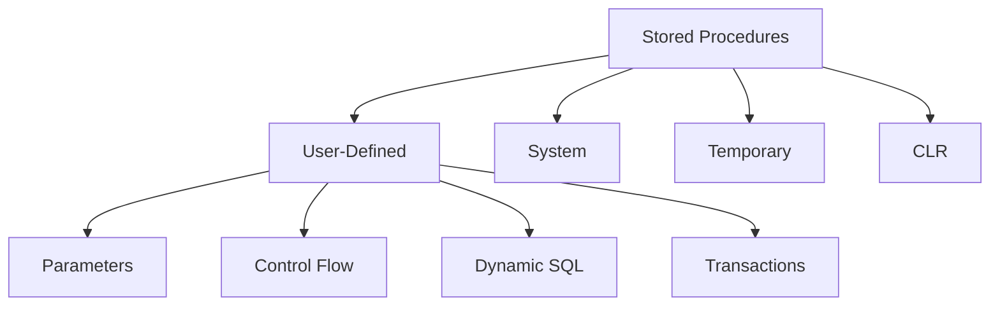

## **Stored Procedures** in T-SQL

**Stored procedures (SPs)** are precompiled sets of SQL statements stored in the SQL Server database.
They improve performance, maintainability, security, and modularity by allowing logic to be executed on the server side.

---

### 1. **Definition and Purpose**

A **Stored Procedure** is a *named, precompiled block* of SQL code that can include queries, control-of-flow logic, variable declarations, and error handling.
They are executed using the `EXEC` or `EXECUTE` command.

**Purpose:**

* Encapsulate business logic.
* Improve performance through precompilation.
* Enhance security by restricting direct access to tables.
* Simplify maintenance and reuse.
* Support transaction management and error handling.

---

### 2. **Syntax**

```sql
CREATE PROCEDURE procedure_name  
    [ @parameter_name data_type [= default_value] [OUTPUT] [, ...n] ]  
AS  
BEGIN  
    -- SQL statements
END;
```

#### Execution

```sql
EXEC procedure_name [ @parameter_name = value [, ...n] ];
-- or
EXECUTE procedure_name [ @parameter_name = value [, ...n] ];
```

---

### 3. **Types of Stored Procedures**

| Type                            | Description                                             | Example                             |
| ------------------------------- | ------------------------------------------------------- | ----------------------------------- |
| **User-defined**                | Created by users for custom logic                       | `CREATE PROCEDURE usp_GetCustomers` |
| **System stored procedures**    | Built-in SPs starting with `sp_` (e.g., `sp_help`)      | `EXEC sp_helpdb;`                   |
| **Temporary stored procedures** | Exist temporarily (session or global scope)             | `#TempProc` or `##GlobalTempProc`   |
| **Extended stored procedures**  | Access external DLLs (deprecated)                       | `xp_cmdshell`                       |
| **CLR stored procedures**       | Written in .NET languages (C#/VB) using CLR integration | `CREATE ASSEMBLY ...`               |

---

### 4. **Parameter Handling**

Stored procedures can accept:

* **Input parameters** (default)
* **Output parameters**
* **Optional parameters** (with default values)

#### Example

```sql
CREATE PROCEDURE usp_GetEmployeeDetails
    @DeptID INT,
    @MinSalary DECIMAL(10,2) = 30000,
    @Count INT OUTPUT
AS
BEGIN
    SELECT * FROM Employees
    WHERE DepartmentID = @DeptID AND Salary >= @MinSalary;

    SELECT @Count = COUNT(*) 
    FROM Employees
    WHERE DepartmentID = @DeptID;
END;
```

#### Execution

```sql
DECLARE @EmpCount INT;
EXEC usp_GetEmployeeDetails @DeptID = 2, @Count = @EmpCount OUTPUT;
PRINT @EmpCount;
```

---

### 5. **Temporary Stored Procedures**

| Type                | Scope                      | Example                                 | Lifespan                 |
| ------------------- | -------------------------- | --------------------------------------- | ------------------------ |
| Local temporary SP  | Visible to current session | `CREATE PROCEDURE #TempProc ...`        | Until session ends       |
| Global temporary SP | Visible to all sessions    | `CREATE PROCEDURE ##GlobalTempProc ...` | Until all sessions close |

---

### 6. **System Stored Procedures**

System SPs (prefix: `sp_`) are predefined procedures provided by SQL Server to perform administrative tasks.

| Procedure       | Description                                             |
| --------------- | ------------------------------------------------------- |
| `sp_help`       | Displays information about database objects             |
| `sp_who`        | Shows current user sessions                             |
| `sp_lock`       | Displays lock information                               |
| `sp_helpdb`     | Shows database details                                  |
| `sp_rename`     | Renames database objects                                |
| `sp_depends`    | Lists dependent objects                                 |
| `sp_executesql` | Executes dynamic SQL safely                             |
| `sp_configure`  | Displays or changes server-level configuration settings |

> ⚠️ System procedures reside in the **`master`** database but can be executed from any database.

---

### 7. **Dynamic SQL within Stored Procedures**

Dynamic SQL allows SQL statements to be constructed and executed at runtime.

#### Using `sp_executesql`

```sql
CREATE PROCEDURE usp_DynamicQuery
    @TableName NVARCHAR(50)
AS
BEGIN
    DECLARE @SQL NVARCHAR(MAX);
    SET @SQL = 'SELECT * FROM ' + QUOTENAME(@TableName);
    EXEC sp_executesql @SQL;
END;
```

> ✅ Use `QUOTENAME()` to prevent SQL injection.
> ⚠️ Avoid string concatenation with user inputs.

---

### 8. **Control-of-Flow in Procedures**

Stored procedures can contain:

* Conditional logic (`IF`, `ELSE`)
* Loops (`WHILE`)
* Error handling (`TRY...CATCH`)
* Transaction management (`BEGIN TRAN`, `COMMIT`, `ROLLBACK`)

#### Example

```sql
CREATE PROCEDURE usp_UpdateSalary
    @EmpID INT, @NewSalary MONEY
AS
BEGIN
    BEGIN TRY
        BEGIN TRAN;
        UPDATE Employees SET Salary = @NewSalary WHERE EmployeeID = @EmpID;
        COMMIT TRAN;
    END TRY
    BEGIN CATCH
        ROLLBACK TRAN;
        PRINT 'Error: ' + ERROR_MESSAGE();
    END CATCH;
END;
```

---

### 9. **Modifying or Removing Stored Procedures**

| Command           | Description           | Syntax                                   |
| ----------------- | --------------------- | ---------------------------------------- |
| `ALTER PROCEDURE` | Modify an existing SP | `ALTER PROCEDURE procedure_name AS ...;` |
| `DROP PROCEDURE`  | Delete a SP           | `DROP PROCEDURE procedure_name;`         |
| `sp_rename`       | Rename a SP           | `EXEC sp_rename 'old_name', 'new_name';` |

---

### 10. **Encryption and Recompilation**

| Feature              | Description                        | Syntax                                                |
| -------------------- | ---------------------------------- | ----------------------------------------------------- |
| **Encryption**       | Obfuscates definition              | `CREATE PROCEDURE usp_Secret WITH ENCRYPTION AS ...;` |
| **Recompilation**    | Forces fresh execution plan        | `CREATE PROCEDURE usp_Refresh WITH RECOMPILE AS ...;` |
| **Manual Recompile** | `EXEC sp_recompile 'usp_Refresh';` |                                                       |

---

### 11. **System Variables and Context Functions in SPs**

Commonly used:

| Function                | Description                     |
| ----------------------- | ------------------------------- |
| `@@PROCID`              | Returns current procedure ID    |
| `OBJECT_NAME(@@PROCID)` | Returns current procedure name  |
| `@@ROWCOUNT`            | Rows affected by last statement |
| `@@ERROR`               | Error code of last statement    |
| `SCOPE_IDENTITY()`      | Identity value in same scope    |

---

### 12. **Advantages of Stored Procedures**

| Advantage               | Description                                              |
| ----------------------- | -------------------------------------------------------- |
| **Performance**         | Precompiled execution plan reduces parsing overhead      |
| **Security**            | Grants can restrict access; protects table data          |
| **Maintainability**     | Centralized logic improves management                    |
| **Network Efficiency**  | Sends single execution call, not multiple SQL statements |
| **Transaction Control** | Can include `BEGIN TRAN`, `COMMIT`, `ROLLBACK`           |
| **Modularity**          | Promotes code reuse and logical separation               |

---

### 13. **Limitations**

* Cannot return multiple result sets to variables directly.
* Debugging is harder compared to inline SQL.
* Execution plan caching can cause parameter sniffing issues.
* Limited flexibility for ad-hoc queries (though mitigated by dynamic SQL).

---

### 14. **Performance Considerations**

* Use `WITH RECOMPILE` to refresh plan when parameters vary greatly.
* Avoid unnecessary dynamic SQL.
* Use `SET NOCOUNT ON;` to reduce message overhead.
* Use appropriate indexes for queries inside SPs.
* Monitor with **`sys.dm_exec_procedure_stats`** DMV.

---

### 15. **Concept Diagram**



---

### 16. **Example: Comprehensive Stored Procedure**

```sql
CREATE PROCEDURE usp_ProcessOrder
    @OrderID INT,
    @Status NVARCHAR(20) OUTPUT
AS
BEGIN
    SET NOCOUNT ON;
    BEGIN TRY
        BEGIN TRAN;

        UPDATE Orders
        SET Status = 'Processed', ProcessDate = GETDATE()
        WHERE OrderID = @OrderID;

        SELECT @Status = 'Order processed successfully';
        COMMIT TRAN;
    END TRY
    BEGIN CATCH
        ROLLBACK TRAN;
        SELECT @Status = 'Error: ' + ERROR_MESSAGE();
    END CATCH;
END;
```

Execution:

```sql
DECLARE @Msg NVARCHAR(100);
EXEC usp_ProcessOrder @OrderID = 101, @Status = @Msg OUTPUT;
PRINT @Msg;
```

---

### 17. **Best Practices**

* Use naming conventions (e.g., `usp_` prefix for user procedures).
* Use `SCHEMABINDING` when procedure depends on stable schema.
* Avoid using `sp_` prefix for user procedures (reserved by system).
* Always handle transactions with `TRY...CATCH`.
* Include `SET NOCOUNT ON;` to prevent extra result messages.
* Use **output parameters** or **RETURN values** for procedure outcomes.

---
