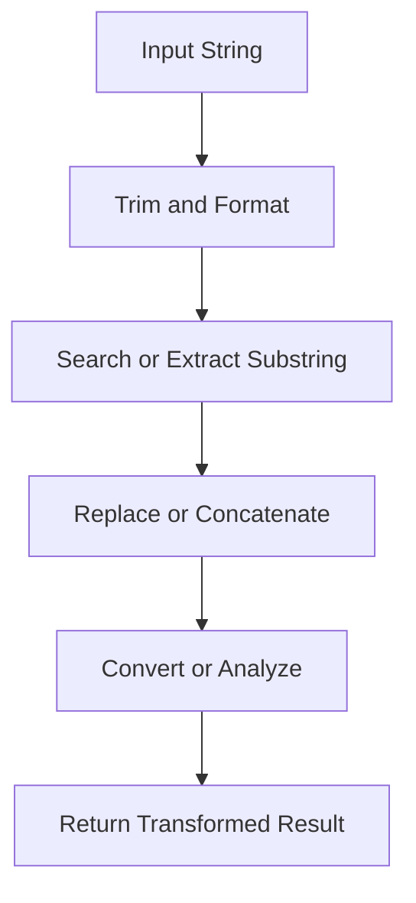

## String Functions in T-SQL

**String functions** in **T-SQL (Transact-SQL)** are used to perform operations on character data types such as `CHAR`, `VARCHAR`, `NCHAR`, and `NVARCHAR`.
They allow manipulation, transformation, extraction, and comparison of string data.

---

### Core Characteristics

* Operate on **character or binary strings**.
* Return either a string, integer, or numeric value depending on the function.
* Support **Unicode (N-prefixed)** and **non-Unicode** string types.
* Often used in **data formatting**, **validation**, and **search operations**.

---

### Categories of String Functions

| Category                            | Examples                                                          |
| ----------------------------------- | ----------------------------------------------------------------- |
| **Case and Formatting**             | `UPPER()`, `LOWER()`, `LTRIM()`, `RTRIM()`, `TRIM()`, `REPLACE()` |
| **Concatenation and Length**        | `CONCAT()`, `CONCAT_WS()`, `LEN()`, `DATALENGTH()`                |
| **Substring and Extraction**        | `LEFT()`, `RIGHT()`, `SUBSTRING()`, `CHARINDEX()`, `PATINDEX()`   |
| **Character Conversion**            | `ASCII()`, `CHAR()`, `UNICODE()`, `NCHAR()`                       |
| **String Comparison**               | `STRCMP()` (through pattern matching), `LIKE`, `COLLATE`          |
| **String Reversal and Replication** | `REVERSE()`, `REPLICATE()`, `SPACE()`                             |
| **Advanced Parsing**                | `STRING_SPLIT()`, `STRING_AGG()`, `FORMAT()`                      |

---

### Common String Functions

#### 1. **UPPER()** and **LOWER()** — Change Case

```sql
SELECT UPPER('sql server'), LOWER('T-SQL');
```

Output: `SQL SERVER`, `t-sql`

---

#### 2. **LTRIM()**, **RTRIM()**, **TRIM()** — Remove Spaces

```sql
SELECT 
    LTRIM('   Hello') AS LeftTrimmed,
    RTRIM('Hello   ') AS RightTrimmed,
    TRIM('   Hello   ') AS Trimmed;
```

---

#### 3. **LEN()** and **DATALENGTH()** — String Length

| Function       | Returns                                        |
| -------------- | ---------------------------------------------- |
| `LEN()`        | Number of characters excluding trailing spaces |
| `DATALENGTH()` | Number of bytes used (includes spaces)         |

```sql
SELECT LEN('Hello '), DATALENGTH('Hello ');
```

---

#### 4. **CONCAT()** and **CONCAT_WS()** — String Concatenation

* `CONCAT()` joins multiple strings.
* `CONCAT_WS()` joins strings with a separator.

```sql
SELECT CONCAT('SQL ', 'Server ', 2025);
SELECT CONCAT_WS('-', 'TSQL', 'Functions', 'Guide');
```

Output: `SQL Server 2025`, `TSQL-Functions-Guide`

---

#### 5. **LEFT()** and **RIGHT()** — Extract from Ends

```sql
SELECT LEFT('Database', 4), RIGHT('Database', 4);
```

Output: `Data`, `base`

---

#### 6. **SUBSTRING()** — Extract Substring

```sql
SELECT SUBSTRING('TransactSQL', 2, 5);
```

Output: `ransa`

---

#### 7. **CHARINDEX()** — Find Position of Substring

```sql
SELECT CHARINDEX('S', 'TransactSQL');
```

Output: `9`

---

#### 8. **PATINDEX()** — Find Pattern Position

Supports wildcards like in `LIKE`.

```sql
SELECT PATINDEX('%SQL%', 'Learn T-SQL Functions');
```

Output: `7`

---

#### 9. **REPLACE()** — Replace Substring

```sql
SELECT REPLACE('Data-Base-System', '-', ' ');
```

Output: `Data Base System`

---

#### 10. **REPLICATE()** and **SPACE()** — Repeat or Add Spaces

```sql
SELECT REPLICATE('*', 5), 'Hello' + SPACE(3) + 'World';
```

Output: `*****`, `Hello   World`

---

#### 11. **REVERSE()** — Reverse String

```sql
SELECT REVERSE('TSQL');
```

Output: `LQS T`

---

#### 12. **ASCII()** and **CHAR()** — Character Conversion

| Function      | Description                           |
| ------------- | ------------------------------------- |
| `ASCII(char)` | Returns ASCII code of first character |
| `CHAR(int)`   | Converts ASCII code to character      |

```sql
SELECT ASCII('A'), CHAR(65);
```

Output: `65`, `A`

---

#### 13. **UNICODE()** and **NCHAR()** — Unicode Conversion

```sql
SELECT UNICODE(N'ñ'), NCHAR(241);
```

---

#### 14. **STRING_AGG()** — Combine Rows into One String

Introduced in SQL Server 2017.

```sql
SELECT STRING_AGG(Name, ', ') AS Names FROM Employees;
```

Output: `Alice, Bob, Charlie`

With ordering:

```sql
SELECT STRING_AGG(Name, ', ') WITHIN GROUP (ORDER BY Name) FROM Employees;
```

---

#### 15. **STRING_SPLIT()** — Split String into Rows

```sql
SELECT value FROM STRING_SPLIT('A,B,C', ',');
```

Output rows:

```
A  
B  
C
```

---

#### 16. **FORMAT()** — Custom String Formatting

```sql
SELECT FORMAT(GETDATE(), 'dddd, MMMM dd, yyyy');
```

Output: `Friday, October 24, 2025`

---

#### 17. **QUOTENAME()** — Add Delimiters for Identifiers

```sql
SELECT QUOTENAME('Employee Name');
```

Output: `[Employee Name]`

---

#### 18. **SOUNDEX()** and **DIFFERENCE()** — Phonetic Matching

| Function                 | Description                    |
| ------------------------ | ------------------------------ |
| `SOUNDEX(string)`        | Returns a phonetic code        |
| `DIFFERENCE(str1, str2)` | Returns similarity score (0–4) |

```sql
SELECT SOUNDEX('Smith'), SOUNDEX('Smyth'), DIFFERENCE('Smith','Smyth');
```

Output: `S530`, `S530`, `4`

---

### String Function Flow



---

### Best Practices

* Use `LEN()` for character counts, not `DATALENGTH()`.
* Prefer `CONCAT()` to handle NULLs safely (it treats them as empty).
* For searching, combine `CHARINDEX()` or `PATINDEX()` with `SUBSTRING()`.
* Use `STRING_AGG()` and `STRING_SPLIT()` for aggregation and parsing instead of custom loops.
* For multilingual data, use **Unicode (`NCHAR`, `NVARCHAR`)** types.

---
