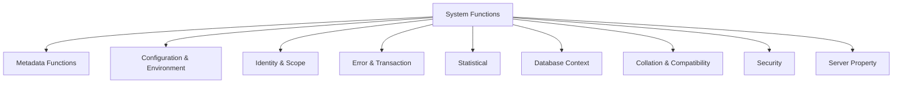

## System Functions in T-SQL

**System functions** in T-SQL return information about the SQL Server environment, database, system state, metadata, and execution context.
They are essential for diagnostics, metadata inspection, performance monitoring, and automation inside queries or stored procedures.

---

### Classification of System Functions

| Category                              | Description                                                | Examples                                      |
| ------------------------------------- | ---------------------------------------------------------- | --------------------------------------------- |
| System Metadata Functions             | Return database, object, and schema information            | `DB_NAME()`, `OBJECT_NAME()`, `SCHEMA_NAME()` |
| Configuration & Environment Functions | Provide details about SQL Server instance and user context | `@@VERSION`, `HOST_NAME()`, `SUSER_NAME()`    |
| Identity & Scope Functions            | Track identity values and scope-related info               | `@@IDENTITY`, `SCOPE_IDENTITY()`              |
| Error & Transaction Functions         | Return error codes or transaction status                   | `@@ERROR`, `@@TRANCOUNT`, `XACT_STATE()`      |
| System Statistical Functions          | Provide performance or system-level metrics                | `@@CPU_BUSY`, `@@IO_BUSY`, `@@PACK_RECEIVED`  |
| Database Context Functions            | Get or change current DB context or session info           | `DB_ID()`, `APP_NAME()`, `SESSION_ID()`       |
| Collation & Compatibility Functions   | Retrieve collation or version info                         | `SERVERPROPERTY()`, `COLLATIONPROPERTY()`     |
| Security Functions                    | Return security or login details                           | `ORIGINAL_LOGIN()`, `SESSION_USER`            |

---

### 1. **System Metadata Functions**

Provide information about databases, schemas, objects, and users.

| Function                                           | Description                | Example                                                                | Result            |
| -------------------------------------------------- | -------------------------- | ---------------------------------------------------------------------- | ----------------- |
| `DB_NAME([database_id])`                           | Returns name of a database | `SELECT DB_NAME(1);`                                                   | `master`          |
| `DB_ID([database_name])`                           | Returns database ID        | `SELECT DB_ID('tempdb');`                                              | `2`               |
| `OBJECT_NAME(object_id)`                           | Returns object name        | `SELECT OBJECT_NAME(OBJECT_ID('sys.objects'));`                        | `objects`         |
| `OBJECT_ID(object_name)`                           | Returns object ID          | `SELECT OBJECT_ID('dbo.Customers');`                                   | e.g., `245575913` |
| `SCHEMA_NAME(schema_id)`                           | Returns schema name        | `SELECT SCHEMA_NAME(1);`                                               | `dbo`             |
| `SCHEMA_ID(schema_name)`                           | Returns schema ID          | `SELECT SCHEMA_ID('dbo');`                                             | `1`               |
| `COL_NAME(object_id, column_id)`                   | Returns column name        | `SELECT COL_NAME(OBJECT_ID('Customers'), 1);`                          | `CustomerID`      |
| `COLUMNPROPERTY(object_id, column_name, property)` | Returns column metadata    | `SELECT COLUMNPROPERTY(OBJECT_ID('Customers'), 'Name', 'IsIdentity');` | `0`               |

---

### 2. **Configuration & Environment Functions**

Used to identify current SQL Server instance, version, and environment settings.

| Function                        | Description                         | Example                             | Result                                   |
| ------------------------------- | ----------------------------------- | ----------------------------------- | ---------------------------------------- |
| `@@VERSION`                     | Returns SQL Server version info     | `SELECT @@VERSION;`                 | `Microsoft SQL Server 2022...`           |
| `SERVERPROPERTY(property_name)` | Returns server-level properties     | `SELECT SERVERPROPERTY('Edition');` | `Developer Edition`                      |
| `APP_NAME()`                    | Returns name of current application | `SELECT APP_NAME();`                | `Microsoft SQL Server Management Studio` |
| `HOST_NAME()`                   | Returns client machine name         | `SELECT HOST_NAME();`               | `USER-PC`                                |
| `SUSER_NAME()`                  | Returns current login name          | `SELECT SUSER_NAME();`              | `sa`                                     |
| `SUSER_ID(login_name)`          | Returns login ID                    | `SELECT SUSER_ID('sa');`            | `1`                                      |
| `SUSER_SNAME([login_id])`       | Returns login name from ID          | `SELECT SUSER_SNAME(1);`            | `sa`                                     |
| `SYSTEM_USER`                   | Returns current system user         | `SELECT SYSTEM_USER;`               | `sa`                                     |
| `SESSION_ID()`                  | Returns current session ID          | `SELECT SESSION_ID();`              | `54`                                     |

---

### 3. **Identity & Scope Functions**

Used to get last identity values inserted into a table.

| Function                      | Description                                | Example                           | Notes                        |
| ----------------------------- | ------------------------------------------ | --------------------------------- | ---------------------------- |
| `@@IDENTITY`                  | Last identity value in **current session** | `SELECT @@IDENTITY;`              | May include triggers         |
| `SCOPE_IDENTITY()`            | Last identity value in **current scope**   | `SELECT SCOPE_IDENTITY();`        | Safer for triggers           |
| `IDENT_CURRENT('table_name')` | Last identity for **specific table**       | `SELECT IDENT_CURRENT('Orders');` | Independent of session/scope |

> ✅ Use `SCOPE_IDENTITY()` for transactional integrity and avoiding cross-table confusion.

---

### 4. **Error & Transaction Functions**

Monitor transaction status and detect runtime errors.

| Function            | Description                                    | Example                | Result            |
| ------------------- | ---------------------------------------------- | ---------------------- | ----------------- |
| `@@ERROR`           | Returns error number from last T-SQL statement | `SELECT @@ERROR;`      | `0` if successful |
| `@@TRANCOUNT`       | Returns current transaction nesting level      | `SELECT @@TRANCOUNT;`  | `1`, `2`, etc.    |
| `XACT_STATE()`      | Returns transaction state (-1, 0, 1)           | `SELECT XACT_STATE();` | `1` = active      |
| `ERROR_NUMBER()`    | Returns last error number                      | Used in `CATCH` block  | —                 |
| `ERROR_MESSAGE()`   | Returns last error message text                | Used in `CATCH` block  | —                 |
| `ERROR_LINE()`      | Returns line number of error                   | Used in `CATCH` block  | —                 |
| `ERROR_PROCEDURE()` | Returns procedure name of error                | Used in `CATCH` block  | —                 |

---

### 5. **System Statistical Functions**

Provide CPU, IO, and network usage metrics (server-wide).

| Function          | Description                                                |
| ----------------- | ---------------------------------------------------------- |
| `@@CPU_BUSY`      | Number of milliseconds CPU was busy since SQL Server start |
| `@@IO_BUSY`       | Number of milliseconds IO was active                       |
| `@@PACK_RECEIVED` | Number of input packets received                           |
| `@@PACK_SENT`     | Number of packets sent                                     |
| `@@TIMETICKS`     | Number of microseconds per tick                            |
| `@@TOTAL_ERRORS`  | Total number of network errors                             |
| `@@TOTAL_READ`    | Total read operations                                      |
| `@@TOTAL_WRITE`   | Total write operations                                     |

> These are **deprecated** for most performance monitoring — use **Dynamic Management Views (DMVs)** instead.

---

### 6. **Database Context Functions**

Provide information about the current database or connection.

| Function                              | Description                              | Example                                       |
| ------------------------------------- | ---------------------------------------- | --------------------------------------------- |
| `DB_NAME()`                           | Current database name                    | `SELECT DB_NAME();`                           |
| `DB_ID()`                             | Current database ID                      | `SELECT DB_ID();`                             |
| `APP_NAME()`                          | Application using the connection         | `SELECT APP_NAME();`                          |
| `CONNECTIONPROPERTY('property_name')` | Returns connection info (e.g., protocol) | `SELECT CONNECTIONPROPERTY('net_transport');` |
| `SESSION_ID()`                        | Session identifier                       | `SELECT @@SPID;`                              |
| `@@SPID`                              | Session process ID                       | `SELECT @@SPID;`                              |

---

### 7. **Collation & Compatibility Functions**

| Function                                      | Description                                            | Example                                                                        |
| --------------------------------------------- | ------------------------------------------------------ | ------------------------------------------------------------------------------ |
| `COLLATIONPROPERTY(collation_name, property)` | Returns property of collation (e.g., case sensitivity) | `SELECT COLLATIONPROPERTY('SQL_Latin1_General_CP1_CI_AS', 'IsCaseSensitive');` |
| `DATABASEPROPERTYEX(database_name, property)` | Returns database property value                        | `SELECT DATABASEPROPERTYEX('master', 'Recovery');`                             |
| `SERVERPROPERTY(property)`                    | Returns server info (edition, version, collation)      | `SELECT SERVERPROPERTY('ProductVersion');`                                     |

---

### 8. **Security Functions**

Provide information about current security context.

| Function                   | Description                               | Example                                |
| -------------------------- | ----------------------------------------- | -------------------------------------- |
| `SESSION_USER`             | Current database user                     | `SELECT SESSION_USER;`                 |
| `CURRENT_USER`             | Synonym for `SESSION_USER`                | `SELECT CURRENT_USER;`                 |
| `USER_NAME([id])`          | Returns user name from ID                 | `SELECT USER_NAME(1);`                 |
| `ORIGINAL_LOGIN()`         | Returns login name of original connection | `SELECT ORIGINAL_LOGIN();`             |
| `IS_SRVROLEMEMBER('role')` | Checks if login is member of server role  | `SELECT IS_SRVROLEMEMBER('sysadmin');` |
| `IS_MEMBER('role')`        | Checks membership in database role        | `SELECT IS_MEMBER('db_owner');`        |

---

### 9. **Server and Database Property Functions**

Used to extract system-level configuration info.

| Function                         | Description              | Example                                  |
| -------------------------------- | ------------------------ | ---------------------------------------- |
| `SERVERPROPERTY('Edition')`      | SQL Server edition       | `SELECT SERVERPROPERTY('Edition');`      |
| `SERVERPROPERTY('MachineName')`  | Host machine name        | `SELECT SERVERPROPERTY('MachineName');`  |
| `SERVERPROPERTY('Collation')`    | Server default collation | `SELECT SERVERPROPERTY('Collation');`    |
| `SERVERPROPERTY('InstanceName')` | Current instance name    | `SELECT SERVERPROPERTY('InstanceName');` |
| `SERVERPROPERTY('ProductLevel')` | Service pack level       | `SELECT SERVERPROPERTY('ProductLevel');` |
| `SERVERPROPERTY('IsClustered')`  | Clustered server (1/0)   | `SELECT SERVERPROPERTY('IsClustered');`  |

---

### 10. **Concept Diagram**

---

### 11. **Best Practices**

* Use **SERVERPROPERTY()** and **DATABASEPROPERTYEX()** for reliable metadata queries.
* Use **TRY/CATCH with ERROR_*** functions for structured error handling.
* Prefer **SCOPE_IDENTITY()** over `@@IDENTITY` to avoid trigger side-effects.
* Use **DMVs** (`sys.dm_exec_*`) for performance data instead of deprecated statistical functions.
* Use **SERVERPROPERTY('Edition')** and `'Version'` for auditing and deployment checks.

---
