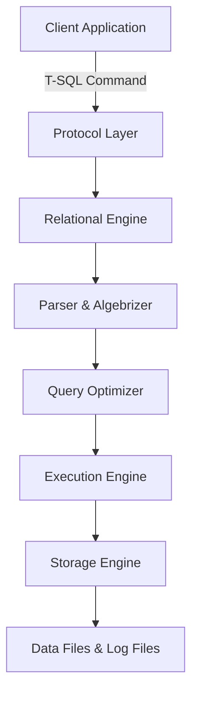
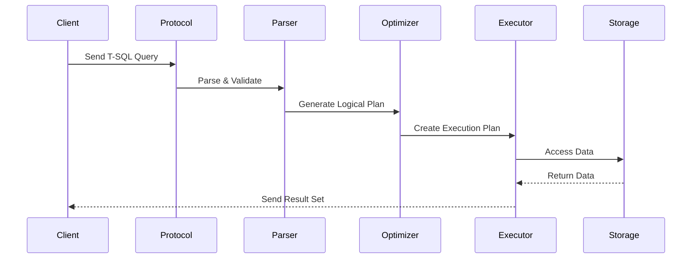

## Transact-SQL (T-SQL)

**Transact-SQL (T-SQL)** is Microsoft’s **proprietary extension of SQL (Structured Query Language)**, used primarily in **Microsoft SQL Server** and **Azure SQL Database**. It expands standard **ANSI SQL** by adding **procedural programming**, **error handling**, **transaction control**, and **system functions**, enabling developers to write powerful database logic directly within the SQL Server engine.

---

### Architecture of T-SQL Execution



---

### Core Features

* **Declarative and Procedural Integration**

  * Combines SQL’s declarative querying with procedural logic (loops, conditionals, variables).
* **Server-side Execution**

  * Runs directly on SQL Server, reducing data transfer and improving performance.
* **Error Handling and Transactions**

  * Provides `TRY...CATCH` blocks and `BEGIN TRANSACTION` controls.
* **Extensibility**

  * Supports user-defined functions, stored procedures, and triggers.

---

### Main Components of T-SQL

| Category                               | Description                                                        |
| -------------------------------------- | ------------------------------------------------------------------ |
| **Data Definition Language (DDL)**     | Defines and manages schema objects such as tables, indexes, views. |
| **Data Manipulation Language (DML)**   | Handles inserting, updating, deleting, and querying data.          |
| **Data Control Language (DCL)**        | Manages permissions and access controls.                           |
| **Transaction Control Language (TCL)** | Controls transactional behavior for atomicity and consistency.     |

---

### Core Syntax Categories

#### Data Definition Language (DDL)

Used to define database objects.

```sql
CREATE DATABASE db_name;
CREATE TABLE table_name (col1 INT, col2 VARCHAR(50));
ALTER TABLE table_name ADD col3 DATETIME;
DROP TABLE table_name;
```

#### Data Manipulation Language (DML)

Used to query and modify data.

```sql
SELECT * FROM employees WHERE salary > 50000;
INSERT INTO employees VALUES (1, 'John', 60000);
UPDATE employees SET salary = salary + 5000 WHERE id = 1;
DELETE FROM employees WHERE id = 1;
```

#### Data Control Language (DCL)

Used to define privileges and roles.

```sql
GRANT SELECT, INSERT ON employees TO user1;
REVOKE INSERT ON employees FROM user1;
```

#### Transaction Control Language (TCL)

Manages logical units of work.

```sql
BEGIN TRANSACTION;
UPDATE accounts SET balance = balance - 1000 WHERE id = 1;
UPDATE accounts SET balance = balance + 1000 WHERE id = 2;
COMMIT TRANSACTION;
-- Or ROLLBACK TRANSACTION;
```

---

### Procedural Extensions

| Construct             | Description                               |
| --------------------- | ----------------------------------------- |
| **Variables**         | Declared using `DECLARE @var datatype`.   |
| **Conditional Logic** | Implemented using `IF...ELSE`.            |
| **Loops**             | Implemented using `WHILE`.                |
| **Error Handling**    | Achieved with `TRY...CATCH`.              |
| **Batch Separators**  | `GO` separates execution batches in SSMS. |

Example:

```sql
DECLARE @total INT = 100;
IF @total > 50
    PRINT 'Large total';
ELSE
    PRINT 'Small total';
```

---

### Control-of-Flow Statements

| Statement            | Purpose                             |
| -------------------- | ----------------------------------- |
| `BEGIN...END`        | Groups multiple statements.         |
| `GOTO`               | Transfers control to a label.       |
| `RETURN`             | Exits from a procedure or function. |
| `BREAK` / `CONTINUE` | Control loop execution.             |
| `WAITFOR`            | Delays execution.                   |

---

### Built-in Functions

| Type             | Examples                                           |
| ---------------- | -------------------------------------------------- |
| **Aggregate**    | `SUM()`, `AVG()`, `MIN()`, `MAX()`, `COUNT()`      |
| **String**       | `LEN()`, `SUBSTRING()`, `CHARINDEX()`, `REPLACE()` |
| **Date & Time**  | `GETDATE()`, `DATEADD()`, `DATEDIFF()`, `FORMAT()` |
| **Mathematical** | `ABS()`, `ROUND()`, `POWER()`, `RAND()`            |
| **Conversion**   | `CAST()`, `CONVERT()`                              |
| **System**       | `@@ROWCOUNT`, `@@ERROR`, `SCOPE_IDENTITY()`        |

---

### Stored Procedures

Reusable T-SQL code blocks stored in the database.

```sql
CREATE PROCEDURE GetEmployeesByDept @deptId INT  
AS  
BEGIN  
    SELECT * FROM Employees WHERE DepartmentId = @deptId;  
END;
```

Executed using:

```sql
EXEC GetEmployeesByDept 2;
```

---

### User-Defined Functions (UDFs)

Return scalar or table data types.

```sql
CREATE FUNCTION GetBonus(@salary INT)
RETURNS INT
AS
BEGIN
    RETURN @salary * 0.10;
END;
```

---

### Triggers

Automatically executed on data changes.

```sql
CREATE TRIGGER trg_AfterInsert
ON Employees
AFTER INSERT
AS
BEGIN
    PRINT 'New record inserted';
END;
```

---

### Transactions and Error Handling

T-SQL ensures **atomicity and recoverability** using transaction statements and structured error handling.

```sql
BEGIN TRY
    BEGIN TRANSACTION;
    UPDATE Orders SET Status = 'Processed' WHERE OrderID = 10;
    COMMIT TRANSACTION;
END TRY
BEGIN CATCH
    ROLLBACK TRANSACTION;
    PRINT ERROR_MESSAGE();
END CATCH;
```

---

### Temporary Objects

| Object Type                 | Description                                                  |
| --------------------------- | ------------------------------------------------------------ |
| **Local Temporary Tables**  | Prefixed with `#`, available to current session.             |
| **Global Temporary Tables** | Prefixed with `##`, accessible to all sessions until closed. |
| **Table Variables**         | Declared with `DECLARE @table TABLE(...)`.                   |

Example:

```sql
CREATE TABLE #Temp (id INT, name VARCHAR(50));
INSERT INTO #Temp VALUES (1, 'A');
SELECT * FROM #Temp;
```

---

### Views and CTEs

| Concept                           | Description                           |
| --------------------------------- | ------------------------------------- |
| **View**                          | Virtual table based on query results. |
| **CTE (Common Table Expression)** | Temporary result set within a query.  |

Example CTE:

```sql
WITH EmployeeCTE AS (
    SELECT id, name, manager_id FROM Employees WHERE manager_id IS NOT NULL
)
SELECT * FROM EmployeeCTE;
```

---

### Error & Exception Handling Tools

| Function          | Description                     |
| ----------------- | ------------------------------- |
| `ERROR_MESSAGE()` | Returns error message text.     |
| `ERROR_NUMBER()`  | Returns error number.           |
| `ERROR_LINE()`    | Returns line number of error.   |
| `@@TRANCOUNT`     | Returns open transaction count. |

---

### Security Features

* Role-based permissions via `GRANT`, `DENY`, `REVOKE`.
* Execution context control using `EXECUTE AS`.
* Parameterized queries prevent SQL injection.

---

### T-SQL vs ANSI SQL

| Aspect                    | ANSI SQL            | T-SQL                                      |
| ------------------------- | ------------------- | ------------------------------------------ |
| **Procedural Constructs** | Limited             | Rich (loops, variables, conditionals)      |
| **Error Handling**        | Standard exceptions | TRY...CATCH mechanism                      |
| **Functions**             | Standard            | Additional built-in functions              |
| **Extensions**            | None                | Proprietary extensions (TOP, OUTPUT, etc.) |
| **Portability**           | High                | Limited (Microsoft-specific)               |

---

### Optimization Considerations

* Use **query plans** and **indexes** for performance tuning.
* Avoid unnecessary cursors and prefer **set-based operations**.
* Use **parameterized queries** for caching and security.
* Analyze **execution plans** in SSMS for bottlenecks.

---

### Diagram: T-SQL Execution Lifecycle



---

### Key Principles

* Follows **declarative SQL foundation** with **procedural extensions**.
* Supports **set-based operations** for scalability.
* Provides **server-side programmability** for automation.
* Maintains **transactional integrity** and **error recovery**.

---
