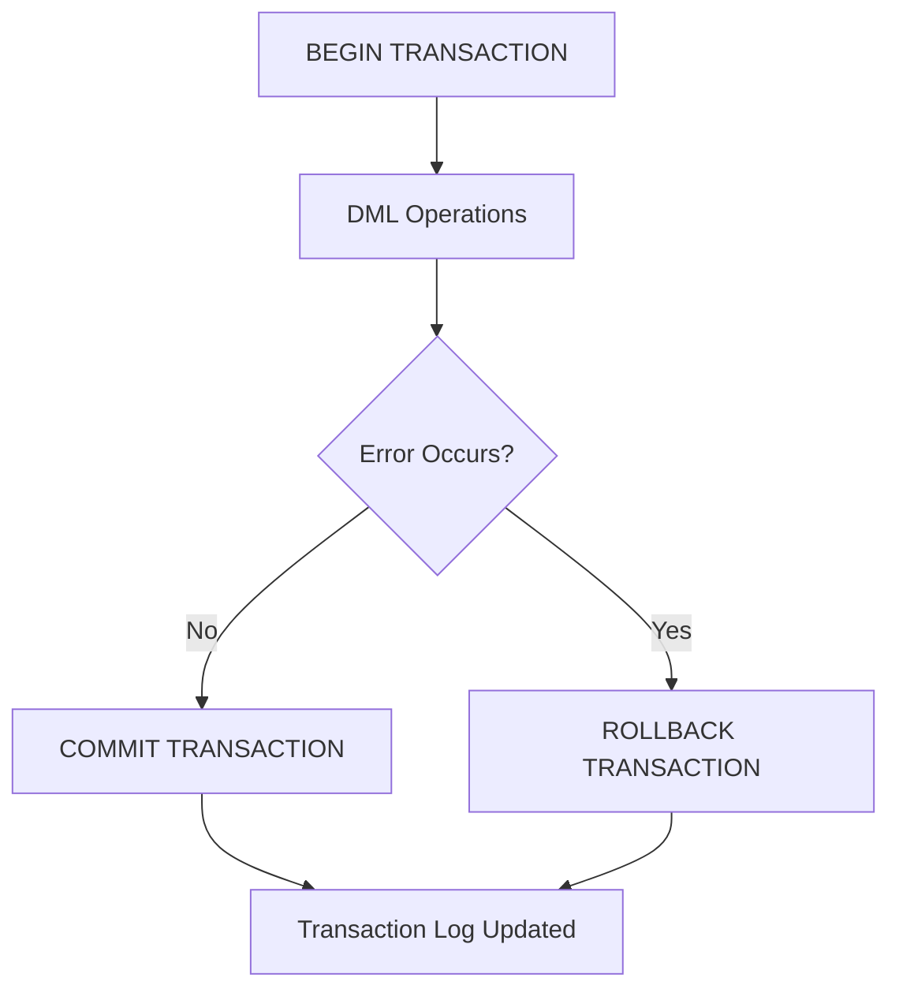
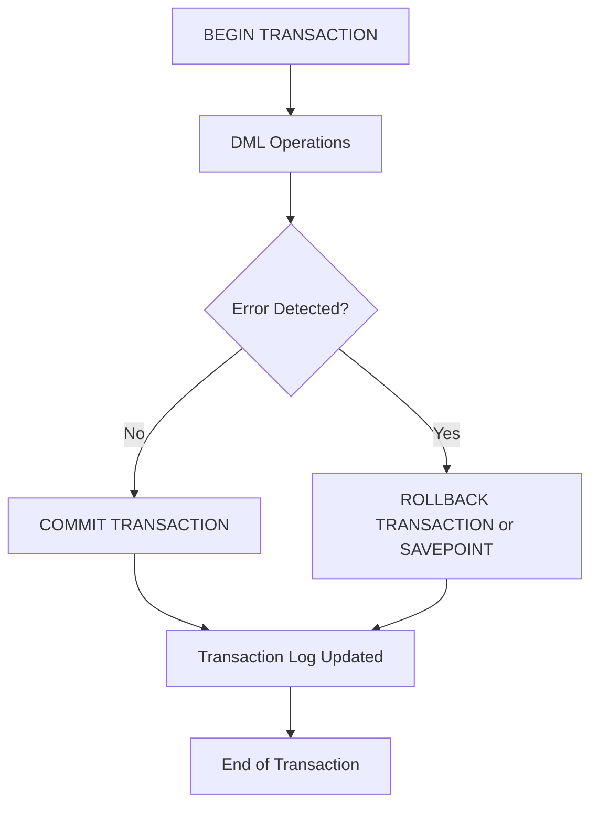

## TCL (Transaction Control Language) in T-SQL

**Transaction Control Language (TCL)** in **T-SQL** manages the **execution flow and consistency** of one or more **Data Manipulation Language (DML)** statements. TCL ensures that operations grouped within a **transaction** follow the **ACID properties** — Atomicity, Consistency, Isolation, and Durability.

TCL statements allow you to **begin**, **commit**, or **rollback** changes, ensuring that data remains consistent even in the case of errors or interruptions.

---

### Core Role of TCL

* Manages logical units of work (transactions).
* Controls commit and rollback of data modifications.
* Ensures data integrity and reliability.
* Works closely with **DML commands (INSERT, UPDATE, DELETE)**.
* Uses **transaction logs** for durability and recovery.

---

### Key TCL Commands

| Command                | Purpose                                                         |
| ---------------------- | --------------------------------------------------------------- |
| `BEGIN TRANSACTION`    | Marks the starting point of a transaction.                      |
| `COMMIT TRANSACTION`   | Saves all changes made during the transaction.                  |
| `ROLLBACK TRANSACTION` | Reverses all changes since the last `BEGIN TRANSACTION`.        |
| `SAVE TRANSACTION`     | Creates a savepoint for partial rollbacks within a transaction. |

---

### Transaction Lifecycle Diagram



---

### ACID Properties in SQL Server

| Property        | Description                                                                                           |
| --------------- | ----------------------------------------------------------------------------------------------------- |
| **Atomicity**   | Ensures all statements in a transaction are treated as a single unit — either all succeed or none do. |
| **Consistency** | Guarantees that a transaction brings the database from one valid state to another.                    |
| **Isolation**   | Prevents concurrent transactions from interfering with each other.                                    |
| **Durability**  | Ensures committed changes persist even after system failure.                                          |

---

### `BEGIN TRANSACTION`

Marks the **starting point** of a transaction.

#### Syntax

```sql
BEGIN TRANSACTION [transaction_name];
```

Example:

```sql
BEGIN TRANSACTION;
UPDATE Accounts SET Balance = Balance - 500 WHERE AccID = 101;
UPDATE Accounts SET Balance = Balance + 500 WHERE AccID = 102;
```

---

### `COMMIT TRANSACTION`

Saves all changes made since the last `BEGIN TRANSACTION`.

#### Syntax

```sql
COMMIT TRANSACTION [transaction_name];
```

Example:

```sql
COMMIT TRANSACTION;
```

#### Notes

* Once committed, changes are **permanent**.
* Transaction logs are updated to mark successful completion.
* Cannot rollback after commit.

---

### `ROLLBACK TRANSACTION`

Reverts all changes made since the transaction began.

#### Syntax

```sql
ROLLBACK TRANSACTION [transaction_name | savepoint_name];
```

Example:

```sql
ROLLBACK TRANSACTION;
```

Partial rollback using savepoint:

```sql
BEGIN TRANSACTION;
UPDATE Products SET Stock = Stock - 10 WHERE ProductID = 1;
SAVE TRANSACTION BeforeDiscount;
UPDATE Products SET Discount = 50 WHERE Category = 'Electronics';
ROLLBACK TRANSACTION BeforeDiscount;  -- undo only discount
COMMIT TRANSACTION;
```

---

### `SAVE TRANSACTION`

Creates a **savepoint** to allow rollback to a specific intermediate point.

#### Syntax

```sql
SAVE TRANSACTION savepoint_name;
```

Example:

```sql
BEGIN TRANSACTION;
INSERT INTO Orders VALUES (101, 'John');
SAVE TRANSACTION BeforeUpdate;
UPDATE Orders SET Customer = 'Jane' WHERE OrderID = 101;
ROLLBACK TRANSACTION BeforeUpdate;
COMMIT TRANSACTION;
```

---

### Nested Transactions

SQL Server supports nested transactions using multiple `BEGIN TRANSACTION` statements.

* Each `BEGIN TRANSACTION` increases `@@TRANCOUNT`.
* Only the **outermost COMMIT** finalizes the transaction.
* A single **ROLLBACK** rolls back the entire chain.

Example:

```sql
BEGIN TRANSACTION Outer;
    INSERT INTO Log VALUES ('Start Outer');
    BEGIN TRANSACTION Inner;
        INSERT INTO Log VALUES ('Start Inner');
    COMMIT TRANSACTION Inner;  -- only decreases @@TRANCOUNT
ROLLBACK TRANSACTION Outer;    -- rolls back everything
```

#### Checking open transactions:

```sql
SELECT @@TRANCOUNT AS ActiveTransactions;
```

---

### Error Handling with Transactions

Combine TCL with `TRY...CATCH` for robust control flow.

Example:

```sql
BEGIN TRY
    BEGIN TRANSACTION;
        UPDATE Accounts SET Balance = Balance - 200 WHERE AccID = 1;
        UPDATE Accounts SET Balance = Balance + 200 WHERE AccID = 2;
    COMMIT TRANSACTION;
END TRY
BEGIN CATCH
    ROLLBACK TRANSACTION;
    PRINT 'Error: ' + ERROR_MESSAGE();
END CATCH;
```

---

### Transaction Isolation Levels

Control how transactions interact with each other (affects concurrency).

| Isolation Level      | Description                              | Phenomena Prevented                  |
| -------------------- | ---------------------------------------- | ------------------------------------ |
| **READ UNCOMMITTED** | Reads uncommitted data (dirty reads).    | None                                 |
| **READ COMMITTED**   | Default; prevents dirty reads.           | Dirty Reads                          |
| **REPEATABLE READ**  | Prevents data from changing during read. | Dirty, Non-repeatable Reads          |
| **SERIALIZABLE**     | Full isolation; locks range of rows.     | Dirty, Non-repeatable, Phantom Reads |
| **SNAPSHOT**         | Uses versioning, not locking.            | Dirty, Non-repeatable, Phantom Reads |

Set isolation level:

```sql
SET TRANSACTION ISOLATION LEVEL SERIALIZABLE;
```

---

### System Functions for Transaction Management

| Function                             | Description                                                                     |
| ------------------------------------ | ------------------------------------------------------------------------------- |
| `@@TRANCOUNT`                        | Returns number of active transactions.                                          |
| `XACT_STATE()`                       | Indicates current transaction state (-1 = uncommittable, 0 = none, 1 = active). |
| `ERROR_NUMBER()` / `ERROR_MESSAGE()` | Used in `CATCH` blocks for diagnostics.                                         |

Example:

```sql
SELECT @@TRANCOUNT AS TransactionCount, XACT_STATE() AS TransactionState;
```

---

### Best Practices

* Always wrap multiple DML operations inside a transaction.
* Check `@@ERROR` or use `TRY...CATCH` for safe rollbacks.
* Use **short transactions** to minimize lock contention.
* Avoid unnecessary nested transactions.
* Always commit or rollback explicitly — never leave transactions open.
* For batch processes, consider using **savepoints** for partial recovery.

---

### Summary Diagram — Transaction Flow



---
