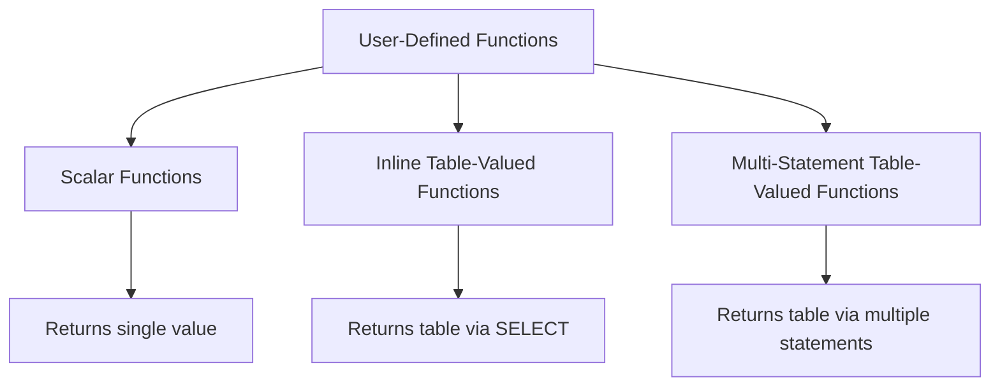

## **User-Defined Functions (UDFs)** in T-SQL

**User-Defined Functions (UDFs)** are routines created by users to encapsulate reusable logic in SQL Server.
Unlike stored procedures, UDFs **return a value** (scalar, table, or table variable) and can be used in queries wherever expressions are allowed.

---

### 1. **Definition and Purpose**

A **User-Defined Function** is a database object that:

* Accepts input parameters (optional)
* Performs operations (calculations, lookups, string manipulation, etc.)
* Returns a **single value** or a **table**

**Purpose:**

* Reuse logic across queries, procedures, and views
* Simplify complex calculations
* Enhance maintainability
* Encapsulate business rules in a modular form

---

### 2. **Types of User-Defined Functions**

| Type                                              | Description                                          | Return Type    | Example                                   |
| ------------------------------------------------- | ---------------------------------------------------- | -------------- | ----------------------------------------- |
| **Scalar Functions**                              | Returns a single value (number, string, date)        | Single value   | `fn_GetDiscount(@CustomerID INT)`         |
| **Inline Table-Valued Functions (iTVF)**          | Returns a table based on a single `SELECT` statement | Table          | `fn_GetOrdersByCustomer(@CustomerID INT)` |
| **Multi-Statement Table-Valued Functions (mTVF)** | Returns a table constructed via multiple statements  | Table variable | `fn_GetTopSellingProducts(@Year INT)`     |

---

### 3. **Syntax**

#### Scalar Function

```sql
CREATE FUNCTION schema.function_name (@param1 datatype, ...)
RETURNS return_datatype
AS
BEGIN
    DECLARE @Result return_datatype;
    -- logic
    SET @Result = ...;
    RETURN @Result;
END;
```

#### Inline Table-Valued Function

```sql
CREATE FUNCTION schema.function_name (@param1 datatype, ...)
RETURNS TABLE
AS
RETURN
(
    SELECT columns
    FROM table
    WHERE condition
);
```

#### Multi-Statement Table-Valued Function

```sql
CREATE FUNCTION schema.function_name (@param1 datatype, ...)
RETURNS @ResultTable TABLE (column1 datatype, column2 datatype, ...)
AS
BEGIN
    INSERT INTO @ResultTable
    SELECT columns FROM table WHERE condition;
    -- additional logic if needed
    RETURN;
END;
```

---

### 4. **Example Usage**

#### Scalar Function

```sql
CREATE FUNCTION dbo.fn_CalcDiscount(@Price DECIMAL(10,2), @DiscountRate DECIMAL(5,2))
RETURNS DECIMAL(10,2)
AS
BEGIN
    RETURN @Price * @DiscountRate / 100;
END;

-- Usage
SELECT dbo.fn_CalcDiscount(500, 10) AS DiscountAmount;
```

#### Inline Table-Valued Function

```sql
CREATE FUNCTION dbo.fn_GetOrdersByCustomer(@CustomerID INT)
RETURNS TABLE
AS
RETURN
(
    SELECT OrderID, OrderDate, TotalAmount
    FROM Orders
    WHERE CustomerID = @CustomerID
);

-- Usage
SELECT * FROM dbo.fn_GetOrdersByCustomer(101);
```

#### Multi-Statement Table-Valued Function

```sql
CREATE FUNCTION dbo.fn_GetTopSellingProducts(@Year INT)
RETURNS @TopProducts TABLE (ProductID INT, TotalSold INT)
AS
BEGIN
    INSERT INTO @TopProducts
    SELECT ProductID, SUM(Quantity)
    FROM Sales
    WHERE YEAR(SaleDate) = @Year
    GROUP BY ProductID
    HAVING SUM(Quantity) > 100;
    
    RETURN;
END;

-- Usage
SELECT * FROM dbo.fn_GetTopSellingProducts(2025);
```

---

### 5. **Differences Between Functions and Stored Procedures**

| Feature               | Stored Procedure                         | User-Defined Function                                 |
| --------------------- | ---------------------------------------- | ----------------------------------------------------- |
| Return Value          | Optional (via OUTPUT)                    | Mandatory (RETURN or table)                           |
| Can be used in SELECT | No                                       | Yes                                                   |
| Side Effects          | Can modify data (INSERT, UPDATE, DELETE) | Cannot modify database state (read-only)              |
| Transactions          | Can manage transactions                  | Cannot start or commit/rollback transactions          |
| Error Handling        | TRY...CATCH allowed                      | Limited error handling                                |
| Execution             | `EXEC procedure`                         | Can be used in expressions, `SELECT`, `WHERE`, `JOIN` |

---

### 6. **Parameter Handling**

* UDFs support **input parameters** only; **output parameters are not allowed**.
* Default parameter values are supported (SQL Server 2008+).

```sql
CREATE FUNCTION dbo.fn_SayHello(@Name NVARCHAR(50) = 'Guest')
RETURNS NVARCHAR(100)
AS
BEGIN
    RETURN 'Hello, ' + @Name + '!';
END;

SELECT dbo.fn_SayHello(); -- Hello, Guest!
SELECT dbo.fn_SayHello('Subham'); -- Hello, Subham!
```

---

### 7. **Best Practices**

* Use **inline table-valued functions** when possible for better performance (avoids row-by-row operations).
* Avoid multi-statement UDFs in large queries; they may hinder query optimization.
* Keep scalar functions deterministic for better indexing and optimization.
* Use proper **schema qualification** (e.g., `dbo`) to improve performance.
* Always **RETURN a value**; cannot leave a scalar function without a return.

---

### 8. **Concept Diagram**



---

### 9. **Use Cases**

| Type                                  | Scenario                                                             |
| ------------------------------------- | -------------------------------------------------------------------- |
| Scalar Function                       | Calculate discounts, taxes, or derived values in queries             |
| Inline Table-Valued Function          | Filtered views, reusable SELECT statements                           |
| Multi-Statement Table-Valued Function | Complex transformations, aggregations, and intermediate computations |

---
