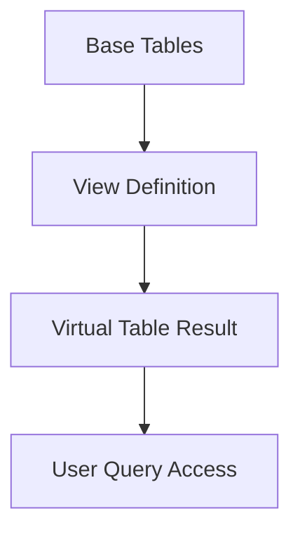

## **Views in MS SQL Server**

---

### **Overview**

A **View** in SQL Server is a **virtual table** that presents data from one or more tables through a **predefined SQL query**. It doesn’t store data physically (except indexed views); it stores only the query definition. Views simplify data access, enhance security, and abstract complex queries.

---

### **Types of Views**

#### **1. Standard Views**

* The most common type.
* Created using a **SELECT** statement from one or more tables.
* Example:

  ```sql
  CREATE VIEW EmployeeDetails AS
  SELECT e.EmployeeID, e.Name, d.DepartmentName
  FROM Employees e
  JOIN Departments d ON e.DeptID = d.DeptID;
  ```

---

#### **2. Indexed Views (Materialized Views)**

* Physically store data in the database.
* Improve performance for complex aggregations and joins.
* Require the view to be **schema-bound**.
* Example:

  ```sql
  CREATE VIEW SalesSummary
  WITH SCHEMABINDING AS
  SELECT ProductID, SUM(Quantity) AS TotalQty
  FROM dbo.Sales
  GROUP BY ProductID;
  ```

  ```sql
  CREATE UNIQUE CLUSTERED INDEX IDX_SalesSummary ON SalesSummary(ProductID);
  ```

---

#### **3. Partitioned Views**

* Combine data from multiple tables (often across databases or servers) with **UNION ALL**.
* Used for **horizontal partitioning**.
* Example:

  ```sql
  CREATE VIEW AllCustomers AS
  SELECT * FROM Customers_India
  UNION ALL
  SELECT * FROM Customers_USA;
  ```

---

### **Characteristics**

* Acts like a **read-only virtual table** by default.
* Can be **updated**, **inserted**, or **deleted** if certain conditions are met (no joins, aggregations, or DISTINCT).
* Can include **built-in functions** and **computed columns**.
* Depends on the **underlying base tables** — any change there affects the view.

---

### **Advantages**

* **Data abstraction**: Hides complex SQL logic from users.
* **Security**: Restricts access to specific columns or rows.
* **Simplified queries**: Encapsulates joins and aggregations.
* **Consistency**: Centralizes logic, avoiding query duplication.
* **Performance (Indexed Views)**: Precomputed results improve speed.

---

### **Limitations**

* Regular views **do not store data**, so performance may depend on base tables.
* **Cannot include** ORDER BY unless TOP or OFFSET is used.
* Updating **multi-table** or **aggregated views** is not allowed.
* Must be **refreshed manually** if schema of base tables changes.

---

### **System Views**

SQL Server provides **built-in system views** to access metadata:

* **`sys.tables`**, **`sys.columns`** – Information about schema objects
* **`sys.views`** – Lists all user-defined views
* **`INFORMATION_SCHEMA.VIEWS`** – ANSI-compliant metadata view

---

### **Best Practices**

* Use **SCHEMABINDING** for better dependency management.
* Keep view logic **simple** and **modular**.
* Avoid nesting too many views.
* Consider **indexed views** for large aggregations.
* Use **encryption** if logic must be hidden:

  ```sql
  CREATE VIEW SecureView WITH ENCRYPTION AS SELECT * FROM Employees;
  ```

---

### **Mermaid Diagram**



---
