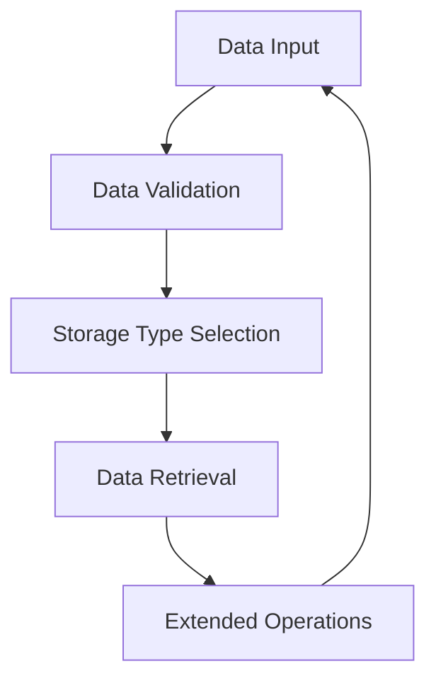

## **SQL Data Types**

Data types define the kind of data that can be stored in a column, ensuring appropriate data handling, storage efficiency, and validation. SQL data types are broadly categorized into **ANSI Standard Types** and **Extended Types**, which are database-specific.

---

### **1. ANSI Standard SQL Data Types**

| **Category**     | **Data Type**    | **Description**                                                                                       |
|-------------------|------------------|-------------------------------------------------------------------------------------------------------|
| **Character**     | `CHAR(n)`        | Fixed-length string of size `n`. Padding occurs if the input is shorter than `n`.                     |
|                   | `VARCHAR(n)`     | Variable-length string with a maximum size of `n`.                                                   |
|                   | `TEXT`           | Large variable-length string (size depends on the database).                                         |
| **Numeric**       | `INT` / `INTEGER`| Integer values; size varies by database (commonly 4 bytes).                                          |
|                   | `SMALLINT`       | Smaller integer values (commonly 2 bytes).                                                          |
|                   | `BIGINT`         | Large integer values (commonly 8 bytes).                                                            |
|                   | `FLOAT` / `REAL` | Approximate floating-point numbers.                                                                 |
|                   | `DECIMAL(p, s)` / `NUMERIC(p, s)` | Exact numeric values with precision `p` and scale `s`.                                                |
| **Date/Time**     | `DATE`           | Date in `YYYY-MM-DD` format.                                                                         |
|                   | `TIME`           | Time in `HH:MM:SS` format.                                                                           |
|                   | `TIMESTAMP`      | Combination of date and time in `YYYY-MM-DD HH:MM:SS` format.                                        |
|                   | `INTERVAL`       | Time duration in years, months, days, hours, minutes, and seconds.                                  |
| **Boolean**       | `BOOLEAN`        | Logical values: `TRUE`, `FALSE`, or `NULL` (optional support in some databases).                    |
| **Binary**        | `BLOB`           | Binary large object for storing binary data, e.g., images or files.                                 |

---

### **2. Extended SQL Data Types**

| **Feature**       | **Data Type**            | **Description**                                                                                       |
|-------------------|--------------------------|-------------------------------------------------------------------------------------------------------|
| **Structured Data**| `JSON`                   | Stores JSON-formatted data (PostgreSQL, MySQL, SQL Server 2016+).                                    |
|                   | `XML`                    | Stores XML-formatted data (SQL Server, Oracle SQL).                                                 |
| **Unique Identifiers**| `UUID`                | Universally unique identifier, often for primary keys (PostgreSQL).                                 |
| **Array Data**    | `ARRAY`                  | Stores arrays of data (PostgreSQL).                                                                 |
| **Geospatial**    | `GEOMETRY`, `GEOGRAPHY`  | Stores geospatial data for location-based operations (MySQL, SQL Server).                           |
| **Large Objects** | `CLOB`                   | Character large object for text data (Oracle SQL, PostgreSQL).                                      |
|                   | `NCLOB`                  | Multi-byte character large object (Oracle SQL).                                                     |

---

### **3. Detailed Syntax and Use Cases**

#### **CHAR and VARCHAR**
- **Syntax:**  
  ```sql
  CREATE TABLE table_name (
      column1 CHAR(10), -- Fixed-length string
      column2 VARCHAR(50) -- Variable-length string
  );
  ```
- **Use Case:**  
  Use `CHAR` for uniformly sized values (e.g., fixed-length codes) and `VARCHAR` for variable-length text (e.g., names).

---

#### **JSON (PostgreSQL, MySQL, SQL Server 2016+)**
- **Syntax:**  
  ```sql
  CREATE TABLE table_name (
      column_name JSON
  );
  ```
- **PostgreSQL Functions for JSON:**  
  ```sql
  SELECT column_name->'key' AS value FROM table_name; -- Access JSON key
  SELECT column_name::JSONB FROM table_name; -- Convert JSON to JSONB
  ```

---

#### **ARRAY (PostgreSQL)**  
- **Syntax:**  
  ```sql
  CREATE TABLE table_name (
      column_name TEXT[] -- Array of text
  );
  ```
- **Use Case:**  
  Use for columns requiring multiple values like tags or categories.

---

#### **UUID (PostgreSQL)**  
- **Syntax:**  
  ```sql
  CREATE TABLE table_name (
      id UUID DEFAULT gen_random_uuid() -- Auto-generate UUID
  );
  ```
- **Use Case:**  
  Ideal for generating unique identifiers for distributed systems.

---

#### **XML (SQL Server, Oracle SQL)**  
- **Syntax:**  
  ```sql
  CREATE TABLE table_name (
      column_name XML
  );
  ```
- **Use Case:**  
  Use for storing and querying hierarchical data structures.

---

### **4. Comparison of Key Data Types**

| **Type**      | **Usage Scenario**            | **Size** (Approx.)       | **Supported By**                              |
|---------------|-------------------------------|--------------------------|-----------------------------------------------|
| **CHAR**      | Fixed-length text             | `n` bytes                | ANSI Standard (All databases).               |
| **VARCHAR**   | Variable-length text          | `n` bytes + 2 bytes      | ANSI Standard (All databases).               |
| **JSON**      | JSON-structured data          | Varies                   | PostgreSQL, MySQL, SQL Server 2016+.         |
| **ARRAY**     | Array data storage            | Depends on element type  | PostgreSQL.                                   |
| **UUID**      | Unique identifiers            | 16 bytes                 | PostgreSQL.                                   |
| **XML**       | Hierarchical data             | Varies                   | SQL Server, Oracle SQL.                      |

---

### **Diagram: Data Types Workflow**



---

### **Additional Notes**
1. **Custom Data Types (PostgreSQL):**  
   - Users can create custom types for specific use cases.  
   ```sql
   CREATE TYPE custom_type AS ENUM ('value1', 'value2');
   ```

2. **Precision and Scale in Numeric Data:**  
   - `DECIMAL(10, 2)` means up to 10 digits, with 2 after the decimal.  

3. **Optimized Data Types:**  
   - Use `SMALLINT` for smaller ranges to save storage.  
   - Use `JSONB` in PostgreSQL for better indexing and performance over `JSON`.  

<!-- Would you like further insights on compatibility across different SQL databases or advanced usage scenarios? -->