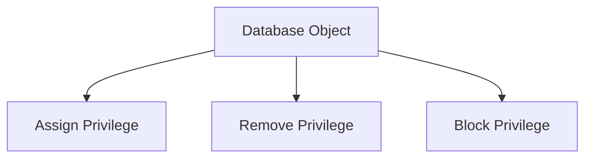

## **Data Control Language (DCL)**  

Data Control Language (DCL) commands manage access permissions and control user privileges in a database. These commands ensure that only authorized users can access or modify the database objects.

---

#### **GRANT**  
**Description:**  
- Assigns specific privileges to users or roles for database objects.  
- Privileges can include `SELECT`, `INSERT`, `UPDATE`, and more.  

**General Syntax:**  
```sql
GRANT privilege_name [, privilege_name] 
ON object_name 
TO user_name [, role_name] 
[WITH GRANT OPTION];
```

**Key Clauses:**  
- **WITH GRANT OPTION:** Allows the grantee to grant the same privileges to others.  

**Database-Specific Details:**  
- **Oracle SQL:** Provides system-level and object-level privileges.  
  ```sql
  GRANT CREATE SESSION TO user_name;
  GRANT SELECT ON table_name TO user_name;
  ```
- **SQL Server:** Uses the same syntax but includes additional roles like `db_owner`, `db_datareader`.  
- **PostgreSQL:** Fully supports role-based privilege assignment.  
  ```sql
  GRANT CONNECT ON DATABASE database_name TO user_name;
  GRANT USAGE ON SCHEMA schema_name TO role_name;
  ```

---

#### **REVOKE**  
**Description:**  
- Removes previously granted privileges from users or roles.  

**General Syntax:**  
```sql
REVOKE privilege_name [, privilege_name] 
ON object_name 
FROM user_name [, role_name] 
[CASCADE | RESTRICT];
```

**Key Clauses:**  
- **CASCADE:** Revokes privileges from users and all dependent users who inherited the privilege.  
- **RESTRICT:** Prevents revoking if dependent users exist.  

**Database-Specific Details:**  
- **Oracle SQL:** Allows revoking of both system and object privileges.  
  ```sql
  REVOKE SELECT ON table_name FROM user_name;
  ```
- **SQL Server:** Syntax remains standard across object types.  
- **PostgreSQL:** Offers granular control over schema and table privileges.  

**Advanced Use (PostgreSQL):**  
```sql
REVOKE ALL PRIVILEGES ON TABLE table_name FROM user_name;
```

---

#### **DENY (SQL Server)**  
**Description:**  
- Explicitly denies specific privileges to users or roles, overriding any granted permissions.  
- Acts as a security barrier to enforce restrictions.  

**General Syntax:**  
```sql
DENY privilege_name [, privilege_name] 
ON object_name 
TO user_name [, role_name];
```

**Key Points:**  
- Overrides `GRANT` permissions.  
- Useful for defining negative permissions explicitly.  

**Example (SQL Server):**  
```sql
DENY SELECT ON table_name TO user_name;
DENY INSERT, UPDATE ON schema_name.table_name TO role_name;
```

**Comparison of GRANT, REVOKE, and DENY:**

| **Command** | **Purpose**                     | **Effect**                                                   |
|-------------|---------------------------------|-------------------------------------------------------------|
| **GRANT**   | Assign privileges               | Enables users/roles to perform specific actions.            |
| **REVOKE**  | Remove granted privileges       | Disables specific actions previously allowed.               |
| **DENY**    | Explicitly block privileges     | Prevents actions regardless of existing `GRANT` permissions.|

---

### **Role Management**  
In DCL, managing roles is critical for centralized permission control.  

| **Database**   | **Role Commands**                                                                                       |
|----------------|--------------------------------------------------------------------------------------------------------|
| **Oracle SQL** | `CREATE ROLE role_name;` `GRANT role_name TO user_name;`                                               |
| **SQL Server** | Built-in roles like `db_owner`, `db_datareader`.                                                       |
| **PostgreSQL** | Role management is flexible with `CREATE ROLE`, `ALTER ROLE`, and `GRANT/REVOKE`.                     |

---

### **Diagram: Permission Flow**


<!-- Would you like additional advanced scenarios such as or permission inheritance? -->