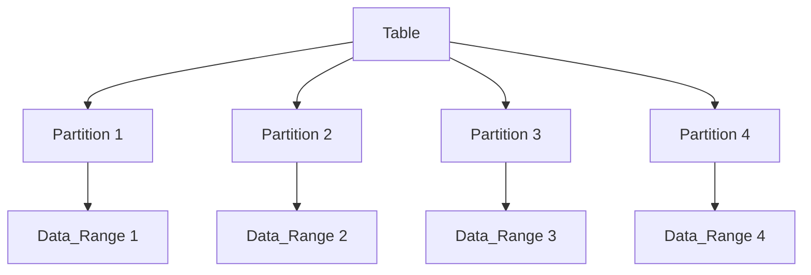

## **SQL Partitioning: Detailed Overview**

**Partitioning** is a database optimization technique that splits large tables into smaller, more manageable pieces, called **partitions**, while maintaining the overall table structure. Each partition is stored separately but is treated as a single logical entity for querying. Partitioning can greatly improve performance, manageability, and scalability, especially for large datasets.

---

### **1. What is Partitioning?**

- **Definition**: Partitioning divides a large table or index into multiple smaller pieces, where each piece is stored independently, but all pieces together form the original table or index.
- **Purpose**: 
  - **Improved Query Performance**: Queries that access a subset of the data can be faster by limiting the search to relevant partitions.
  - **Manageability**: Smaller partitions are easier to manage (e.g., back up, restore, or maintain).
  - **Scalability**: Allows handling large datasets more effectively by distributing data across multiple storage units or servers.
  
---

### **2. Types of Partitioning**

There are several types of partitioning strategies available, each serving different use cases:

#### **Range Partitioning**
- **Definition**: Data is divided based on a range of values in a specified column. Each partition holds data within a specific range.
- **Use Case**: Typically used for data that naturally falls into ranges, like dates (e.g., sales data by year).
- **Example**: A table partitioned by `date` could store records from January to March in one partition, April to June in another, and so on.

#### **List Partitioning**
- **Definition**: Data is divided based on a list of values in a specified column. Each partition contains rows that match one of the specified values.
- **Use Case**: Useful when data has a limited set of discrete values (e.g., region, country).
- **Example**: A sales table partitioned by `region` might have partitions for `North America`, `Europe`, and `Asia`.

#### **Hash Partitioning**
- **Definition**: A hashing function is applied to the partition key to assign rows to partitions. This is useful when no natural range or list exists.
- **Use Case**: Effective for distributing data evenly across partitions, especially when data distribution is uniform.
- **Example**: A table of users could be hash-partitioned on the `user_id` column, distributing users evenly across partitions.

#### **Composite Partitioning** (Subpartitioning)
- **Definition**: A combination of two or more partitioning methods. For example, range partitioning is applied first, then each range is subpartitioned using hash or list partitioning.
- **Use Case**: Useful when complex data distribution is required for large datasets with multiple criteria.
- **Example**: Partitioning sales data by `year` (range) and then by `region` (list).

---

### **3. Partitioning Syntax**

#### **Range Partitioning**
- **Syntax**:  
  ```sql
  CREATE TABLE table_name (
      column1 datatype,
      column2 datatype,
      ...
  )
  PARTITION BY RANGE (partition_column) (
      PARTITION p1 VALUES LESS THAN (2021),
      PARTITION p2 VALUES LESS THAN (2022),
      PARTITION p3 VALUES LESS THAN (2023)
  );
  ```

#### **List Partitioning**
- **Syntax**:  
  ```sql
  CREATE TABLE table_name (
      column1 datatype,
      column2 datatype,
      ...
  )
  PARTITION BY LIST (partition_column) (
      PARTITION p1 VALUES IN ('North America', 'Europe'),
      PARTITION p2 VALUES IN ('Asia', 'Australia')
  );
  ```

#### **Hash Partitioning**
- **Syntax**:  
  ```sql
  CREATE TABLE table_name (
      column1 datatype,
      column2 datatype,
      ...
  )
  PARTITION BY HASH (partition_column)
  PARTITIONS 4;  -- Number of partitions
  ```

#### **Composite Partitioning**
- **Syntax**:  
  ```sql
  CREATE TABLE table_name (
      column1 datatype,
      column2 datatype,
      ...
  )
  PARTITION BY RANGE (partition_column1)
  SUBPARTITION BY HASH (partition_column2)
  (
      PARTITION p1 VALUES LESS THAN (2021),
      PARTITION p2 VALUES LESS THAN (2022)
  );
  ```

---

### **4. Managing Partitions**

#### **Adding Partitions**
- **Syntax**:  
  ```sql
  ALTER TABLE table_name ADD PARTITION (
      PARTITION p4 VALUES LESS THAN (2024)
  );
  ```

#### **Dropping Partitions**
- **Syntax**:  
  ```sql
  ALTER TABLE table_name DROP PARTITION p1;
  ```

#### **Renaming Partitions**
- **Syntax**:  
  ```sql
  ALTER TABLE table_name RENAME PARTITION p1 TO new_partition_name;
  ```

#### **Merging Partitions**
- **Syntax**:  
  ```sql
  ALTER TABLE table_name MERGE PARTITIONS p1, p2;
  ```

#### **Splitting Partitions**
- **Syntax**:  
  ```sql
  ALTER TABLE table_name SPLIT PARTITION p1 AT (2023) INTO (
      PARTITION p1a VALUES LESS THAN (2023),
      PARTITION p1b VALUES LESS THAN (2024)
  );
  ```

---

### **5. Advantages of Partitioning**

- **Improved Query Performance**:  
  - Partitioning allows SQL queries to access only the relevant partitions instead of scanning the entire table. This can significantly improve performance for large tables.
  
- **Manageability**:  
  - Smaller partitions are easier to manage, especially for backup, restore, and maintenance. Partition-level management (e.g., dropping or archiving old data) can be more efficient than dealing with an entire table.

- **Efficient Data Distribution**:  
  - Partitioning helps distribute data across multiple storage devices or databases, which can optimize the overall system performance and resource utilization.

- **Parallelism**:  
  - Many database systems support parallel execution of queries on multiple partitions, which can improve performance for large-scale operations.

---

### **6. Partitioning Considerations**

- **Storage Overhead**:  
  - Each partition requires its own storage, which may increase disk space usage. It's important to monitor disk space usage and adjust partitioning strategies accordingly.
  
- **Indexing**:  
  - Indexing strategies must be adjusted for partitioned tables. While each partition can have its own index, global indexes that span all partitions can be more complex to maintain.

- **Partition Pruning**:  
  - When querying partitioned tables, the database may not need to scan all partitions. This is known as **partition pruning**. Ensuring proper partitioning strategies will optimize this process.

- **Foreign Keys**:  
  - Some DBMSs (e.g., MySQL) do not support foreign keys for partitioned tables. This should be taken into account when designing the schema.

- **Data Distribution**:  
  - A poor partitioning strategy can lead to skewed data distribution, where one partition holds most of the data, negating the benefits of partitioning.

---

### **7. Partitioning Syntax Comparison Across SQL Implementations**

| **Operation**        | **MySQL**                     | **SQL Server**                | **Oracle SQL**               | **PostgreSQL**               |
|----------------------|-------------------------------|-------------------------------|------------------------------|------------------------------|
| **Create Partition**  | `PARTITION BY RANGE, LIST, HASH` | `PARTITION BY RANGE, LIST`    | `PARTITION BY RANGE, LIST, HASH` | `PARTITION BY RANGE, LIST, HASH` |
| **Add Partition**     | `ALTER TABLE ... ADD PARTITION` | `ALTER PARTITION SCHEME ...`  | `ALTER TABLE ... ADD PARTITION` | `ALTER TABLE ... ADD PARTITION` |
| **Drop Partition**    | `ALTER TABLE ... DROP PARTITION` | `ALTER PARTITION SCHEME ...`  | `ALTER TABLE ... DROP PARTITION` | `ALTER TABLE ... DROP PARTITION` |
| **Split Partition**   | `ALTER TABLE ... SPLIT PARTITION` | Not Supported                | `ALTER TABLE ... SPLIT PARTITION` | `ALTER TABLE ... SPLIT PARTITION` |
| **Merge Partition**   | `ALTER TABLE ... MERGE PARTITION` | Not Supported                | `ALTER TABLE ... MERGE PARTITION` | `ALTER TABLE ... MERGE PARTITION` |

---

### **8. Diagram of Partitioning**



- **Explanation**:  
  - The **Table** is logically divided into multiple partitions.
  - Each partition holds a specific range of data, such as time-based or region-based data.

---

### **9. Conclusion**

Partitioning is a powerful technique for managing large datasets, improving query performance, and enhancing database scalability. By carefully choosing the partitioning strategy that best fits your data's characteristics, you can optimize both read and write operations. However, partitioning requires careful consideration of the database's limitations and performance trade-offs to avoid complexity and inefficiencies.