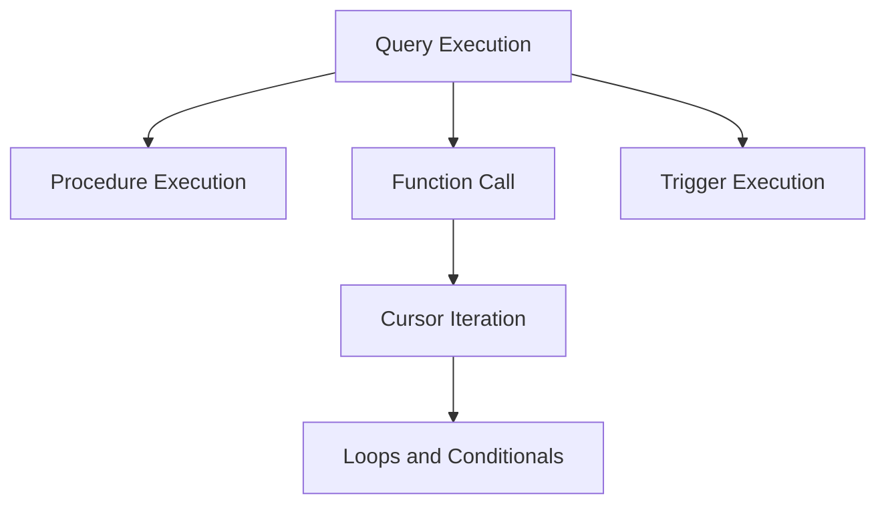

### **Procedural SQL (PL/SQL or T-SQL)**  

Procedural SQL extends standard SQL with programming constructs like variables, loops, and conditional statements, enabling more robust and complex database operations.

---

### **1. Stored Procedures**  
**Description:**  
- Precompiled SQL code that can be executed with optional parameters.  
- Enhances performance by reducing the need to parse SQL repeatedly.  

**General Syntax:**  

- **PL/SQL (Oracle SQL):**  
   ```sql
   CREATE OR REPLACE PROCEDURE procedure_name (param1 IN data_type, param2 OUT data_type)
   IS
   BEGIN
       -- SQL Statements
   END procedure_name;
   ```
   
- **T-SQL (SQL Server):**  
   ```sql
   CREATE PROCEDURE procedure_name @param1 data_type, @param2 data_type OUTPUT
   AS
   BEGIN
       -- SQL Statements
   END;
   ```

**Usage:**  
```sql
EXEC procedure_name(param1, param2); -- SQL Server
CALL procedure_name(param1, param2); -- Oracle SQL
```

---

### **2. Functions**  
**Description:**  
- Returns a single value or table as output.  
- Primarily used for calculations or deriving values.

**General Syntax:**  

- **PL/SQL (Oracle SQL):**  
   ```sql
   CREATE OR REPLACE FUNCTION function_name (param1 IN data_type)
   RETURN data_type IS
   BEGIN
       RETURN value;
   END function_name;
   ```
   
- **T-SQL (SQL Server):**  
   ```sql
   CREATE FUNCTION function_name (@param1 data_type)
   RETURNS data_type
   AS
   BEGIN
       RETURN value;
   END;
   ```

**Usage:**  
```sql
SELECT function_name(param1); -- Within SQL queries
```

---

### **3. Triggers**  
**Description:**  
- Automatically executed actions in response to specific events on a table or view.  
- Used for auditing, validation, or cascading changes.  

**General Syntax:**  

- **PL/SQL (Oracle SQL):**  
   ```sql
   CREATE OR REPLACE TRIGGER trigger_name
   BEFORE | AFTER INSERT | UPDATE | DELETE ON table_name
   FOR EACH ROW
   BEGIN
       -- SQL Statements
   END trigger_name;
   ```
   
- **T-SQL (SQL Server):**  
   ```sql
   CREATE TRIGGER trigger_name
   ON table_name
   AFTER INSERT, UPDATE, DELETE
   AS
   BEGIN
       -- SQL Statements
   END;
   ```

---

### **4. Cursors**  
**Description:**  
- Allows row-by-row processing of query results.  
- Typically used in loops for iterative operations.  

**General Syntax:**  

- **PL/SQL (Oracle SQL):**  
   ```sql
   DECLARE cursor_name CURSOR FOR
   SELECT columns FROM table_name;
   
   BEGIN
       OPEN cursor_name;
       FETCH cursor_name INTO variable_name;
       CLOSE cursor_name;
   END;
   ```
   
- **T-SQL (SQL Server):**  
   ```sql
   DECLARE cursor_name CURSOR FOR
   SELECT columns FROM table_name;
   
   OPEN cursor_name;
   FETCH NEXT FROM cursor_name INTO variable_name;
   CLOSE cursor_name;
   DEALLOCATE cursor_name;
   ```

---

### **5. Loops and Conditional Statements**

#### **WHILE Loop**  
- **T-SQL (SQL Server):**  
   ```sql
   WHILE condition
   BEGIN
       -- SQL Statements
   END;
   ```
   
- **PL/SQL (Oracle SQL):**  
   ```sql
   WHILE condition LOOP
       -- SQL Statements
   END LOOP;
   ```

#### **FOR Loop**  
- **PL/SQL (Oracle SQL):**  
   ```sql
   FOR variable IN start_value..end_value LOOP
       -- SQL Statements
   END LOOP;
   ```

#### **IF-ELSE Conditional Statements**  
- **T-SQL (SQL Server):**  
   ```sql
   IF condition
       BEGIN
           -- SQL Statements
       END
   ELSE
       BEGIN
           -- SQL Statements
       END;
   ```
   
- **PL/SQL (Oracle SQL):**  
   ```sql
   IF condition THEN
       -- SQL Statements
   ELSE
       -- SQL Statements
   END IF;
   ```

---

### **Feature Comparison Table**

| **Feature**      | **PL/SQL (Oracle SQL)**               | **T-SQL (SQL Server)**                |
|-------------------|---------------------------------------|---------------------------------------|
| **Stored Procedure** | Supports `IN`, `OUT`, `IN OUT` parameters | Supports `INPUT`, `OUTPUT` parameters  |
| **Functions**     | Allows RETURN of a single value       | Allows RETURN of scalar/table values   |
| **Triggers**      | BEFORE and AFTER triggers supported   | Only AFTER triggers supported          |
| **Cursors**       | Explicit cursor declaration required  | Both static and dynamic cursors        |
| **Loops**         | Supports `FOR`, `WHILE`              | Primarily supports `WHILE`            |
| **Conditionals**  | `IF...THEN...ELSE`                   | `IF...ELSE`                           |

---

### **Diagram: Procedural SQL Workflow**



<!-- Would you like examples for real-world scenarios, such as auditing triggers or performance considerations with cursors? -->