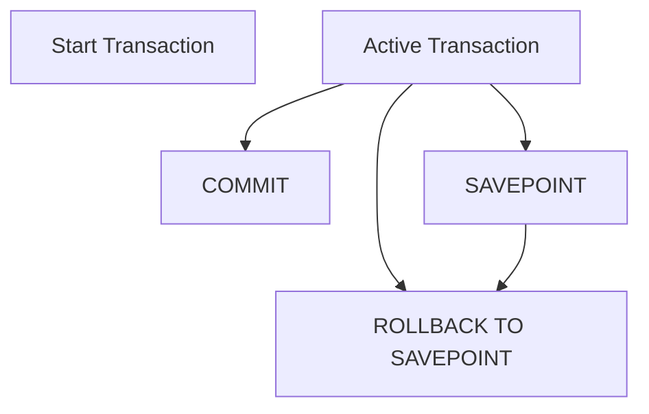

### **Transaction Control Language (TCL)**  

Transaction Control Language commands are used to manage database transactions to maintain data integrity and ensure consistent states in a multi-user environment.

---

#### **COMMIT**  
**Description:**  
- Commits a transaction, permanently saving all changes made during the transaction.  
- Once a `COMMIT` is issued, the changes cannot be undone.  

**General Syntax:**  
```sql
COMMIT;
```

**Database-Specific Details:**  
- **MySQL, SQL Server, PostgreSQL, Oracle SQL:** Standard syntax applies.  
- **MySQL:** Implicit commit happens for certain statements like `CREATE`, `ALTER`.  

**Usage Tip:**  
Use `COMMIT` at logical checkpoints to reduce rollback overhead.

---

#### **ROLLBACK**  
**Description:**  
- Undoes changes made during the current transaction or to a specific savepoint, restoring the database to its previous state.  

**General Syntax:**  
```sql
ROLLBACK;
```

**Database-Specific Details:**  
- **MySQL:** Automatically rolls back on transaction failure if `AUTOCOMMIT` is disabled.  
- **Oracle SQL:** Supports partial rollback using `SAVEPOINT`.  

**Advanced Syntax (Partial Rollback):**  
```sql
ROLLBACK TO SAVEPOINT savepoint_name;
```

---

#### **SAVEPOINT**  
**Description:**  
- Defines a point within a transaction to which changes can be rolled back without affecting the entire transaction.  
- Useful for breaking down complex transactions into manageable checkpoints.  

**General Syntax:**  
```sql
SAVEPOINT savepoint_name;
```

**Database-Specific Details:**  
- **Oracle SQL:** Allows nested transactions via `SAVEPOINT`.  
- **PostgreSQL:** Fully supports savepoints in transactional workflows.  
- **SQL Server:** Does not support savepoints explicitly but provides equivalent functionality via transaction nesting.

**Usage Example:**  
```sql
SAVEPOINT point1;
/* Perform some operations */
ROLLBACK TO SAVEPOINT point1;
COMMIT;
```

---

#### **SET TRANSACTION**  
**Description:**  
- Configures transaction properties such as isolation level and read/write access.  
- Ensures control over data consistency and transaction concurrency.  

**General Syntax:**  
```sql
SET TRANSACTION [READ WRITE | READ ONLY] [ISOLATION LEVEL isolation_level];
```

**Database-Specific Details:**  
- **Oracle SQL:** Supports advanced isolation levels like `SERIALIZABLE` and `READ COMMITTED`.  
  ```sql
  SET TRANSACTION ISOLATION LEVEL SERIALIZABLE READ ONLY;
  ```
- **PostgreSQL:** Allows setting session-wide transaction properties.  
  ```sql
  BEGIN;
  SET TRANSACTION ISOLATION LEVEL REPEATABLE READ;
  ```
- **MySQL:** Uses `SET TRANSACTION` mainly for session-level isolation.  
  ```sql
  SET TRANSACTION ISOLATION LEVEL READ COMMITTED;
  ```

---

### **Transaction States and Considerations**  

| **State**              | **Description**                          | **Example Operation**    |
|-------------------------|------------------------------------------|---------------------------|
| **Active**             | A transaction is ongoing and can issue statements. | `INSERT`, `UPDATE`, etc. |
| **Partially Committed** | Changes are staged for commit.           | After `COMMIT` begins.    |
| **Failed**             | A transaction error has occurred.        | Syntax or logical errors. |
| **Aborted**            | A rollback has been executed.            | `ROLLBACK` command.       |
| **Committed**          | Changes are permanently saved.           | After `COMMIT` ends.      |

---

### **Diagram: Transaction Workflow**


Would you like any advanced scenarios, such as nested transactions or database-specific behavior for distributed transactions?
