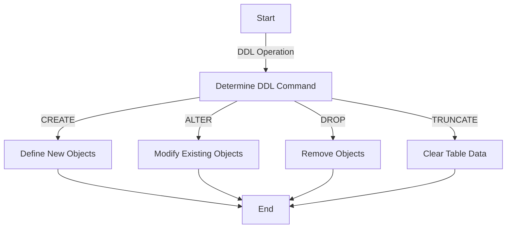

### **Data Definition Language (DDL)**  
DDL is a subset of SQL commands used to define and modify the structure of database objects such as tables, schemas, views, and indexes. Unlike Data Manipulation Language (DML), DDL operations are auto-committed, meaning they are irreversible without explicit backup.

---

### **CREATE**  
Used to create new database objects.  

#### **Table**  
Creates a table with specified columns and data types.  
**Syntax:**  
```sql
CREATE TABLE table_name (
    column1 data_type [constraint],
    column2 data_type [constraint],
    ...
);
```

#### **Schema**  
Defines a logical container for database objects.  
**Syntax:**  
```sql
CREATE SCHEMA schema_name [AUTHORIZATION user_name];
```

#### **Index**  
Improves query performance by creating an index on one or more columns.  
**Syntax:**  
```sql
CREATE [UNIQUE] INDEX index_name
ON table_name (column1 [ASC|DESC], column2 [ASC|DESC], ...);
```

#### **View**  
Creates a virtual table based on a query.  
**Syntax:**  
```sql
CREATE VIEW view_name AS
SELECT column1, column2, ...
FROM table_name
[WHERE condition];
```

#### **Sequence** *(Oracle SQL, PostgreSQL)*  
Creates a sequence generator for unique values.  
**Syntax:**  
```sql
CREATE SEQUENCE sequence_name
[START WITH start_value]
[INCREMENT BY increment_value]
[MAXVALUE max_value | NOMAXVALUE]
[MINVALUE min_value | NOMINVALUE]
[CYCLE | NOCYCLE];
```

#### **Synonym** *(Oracle SQL)*  
Defines an alias for another database object.  
**Syntax:**  
```sql
CREATE [PUBLIC] SYNONYM synonym_name
FOR object_name;
```

#### **Materialized View** *(Oracle SQL, PostgreSQL)*  
Creates a view that stores data physically.  
**Syntax:**  
```sql
CREATE MATERIALIZED VIEW view_name
AS SELECT column1, column2, ...
FROM table_name
[WITH DATA | WITHOUT DATA];
```

---

### **ALTER**  
Used to modify existing database objects.  

#### **Table**  
- **Add a Column:**  
  ```sql
  ALTER TABLE table_name
  ADD column_name data_type [constraint];
  ```
- **Modify a Column:**  
  ```sql
  ALTER TABLE table_name
  MODIFY column_name new_data_type [new_constraint];
  ```
- **Delete a Column:**  
  ```sql
  ALTER TABLE table_name
  DROP COLUMN column_name;
  ```
- **Add/Drop Constraints:**  
  ```sql
  ALTER TABLE table_name
  ADD CONSTRAINT constraint_name constraint_definition;
  ALTER TABLE table_name
  DROP CONSTRAINT constraint_name;
  ```

#### **Schema**  
Renames or transfers ownership of a schema.  
**Syntax:**  
```sql
ALTER SCHEMA schema_name
[RENAME TO new_schema_name | OWNER TO new_owner];
```

#### **Index** *(SQL Server)*  
- **Rebuild an Index:**  
  ```sql
  ALTER INDEX index_name
  ON table_name REBUILD;
  ```
- **Defragment an Index:**  
  ```sql
  ALTER INDEX index_name
  ON table_name REORGANIZE;
  ```

---

### **DROP**  
Used to delete database objects permanently.  

#### **Table**  
**Syntax:**  
```sql
DROP TABLE table_name [CASCADE];
```

#### **Schema**  
**Syntax:**  
```sql
DROP SCHEMA schema_name [CASCADE];
```

#### **View**  
**Syntax:**  
```sql
DROP VIEW view_name;
```

#### **Index**  
**Syntax:**  
```sql
DROP INDEX index_name ON table_name;
```

#### **Sequence**  
**Syntax:**  
```sql
DROP SEQUENCE sequence_name;
```

---

### **TRUNCATE**  
Used to remove all records from a table without logging individual row deletions.  
**Syntax:**  
```sql
TRUNCATE TABLE table_name;
```

---

### **Comparison Table: CREATE, ALTER, DROP, TRUNCATE**  

| **Operation** | **Purpose**                           | **Impact**                                           | **Supports Rollback?** |  
|---------------|---------------------------------------|-----------------------------------------------------|-------------------------|  
| **CREATE**    | Defines new database objects          | Adds a new structure to the database                | No                      |  
| **ALTER**     | Modifies existing database objects    | Changes the structure, such as columns or constraints | No                      |  
| **DROP**      | Deletes objects permanently           | Removes structure and data; irreversible            | No                      |  
| **TRUNCATE**  | Deletes all records in a table        | Removes data but retains structure; resets identity | No                      |  

---

### **DDL Operations Flowchart**  


--- 

### **Additional Tricks and Tips**  
1. Use `IF EXISTS` in `DROP` statements to avoid errors if the object does not exist.  
   ```sql
   DROP TABLE IF EXISTS table_name;
   ```
2. Use `CASCADE` with `DROP` to automatically remove dependent objects.  
3. Combine multiple `ALTER` operations to minimize downtime.  
   ```sql
   ALTER TABLE table_name
   ADD column_name data_type,
   DROP COLUMN old_column_name;
   ```
4. For Oracle, enable materialized view refresh with `ON COMMIT`.  

Would you like further details or examples?