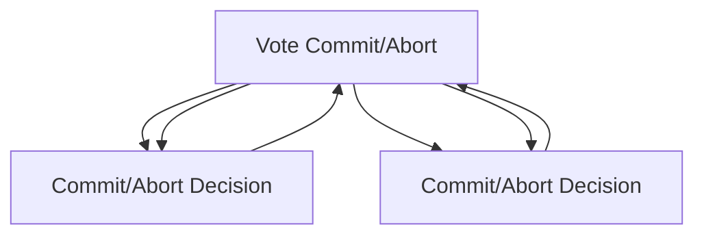

### **Advanced Scenarios: Nested and Distributed Transactions**

---

#### **Nested Transactions**  
**Description:**  
- A transaction within another transaction.  
- Useful for managing complex workflows where partial rollbacks are needed without undoing the entire transaction.  

**Database Support:**  
- **Oracle SQL:** Supports via `SAVEPOINT`.  
- **PostgreSQL:** Implements savepoints for similar functionality.  
- **SQL Server:** Provides nested transactions explicitly.  
- **MySQL:** Does not natively support nested transactions but allows emulation using savepoints.

**Syntax (SQL Server):**  
```sql
BEGIN TRANSACTION outer_transaction;
-- Outer transaction operations
SAVE TRANSACTION savepoint_name;
-- Nested transaction simulation
BEGIN TRANSACTION inner_transaction;
-- Inner transaction operations
IF condition THEN ROLLBACK TRANSACTION inner_transaction;
END TRANSACTION inner_transaction;
-- Continue with outer transaction
COMMIT TRANSACTION outer_transaction;
```

**Syntax (Oracle SQL/PostgreSQL):**  
```sql
BEGIN;
SAVEPOINT savepoint_name;
-- Inner operations
ROLLBACK TO SAVEPOINT savepoint_name;
-- Continue with outer transaction
COMMIT;
```

---

#### **Distributed Transactions**  
**Description:**  
- Transactions involving multiple databases or systems.  
- Ensures atomicity across different nodes using two-phase commit (2PC).  

**Implementation Details:**  
- Requires a transaction manager or coordinator.  
- **Oracle SQL:** Uses Oracle's distributed transaction features with `DB_LINK`.  
- **SQL Server:** Implements distributed transactions via Microsoft Distributed Transaction Coordinator (MSDTC).  
- **PostgreSQL:** Requires third-party tools like `pglogical` or `Bucardo` for advanced cases.  
- **MySQL:** Relies on XA Transactions.

**Syntax (SQL Server - MSDTC):**  
```sql
BEGIN DISTRIBUTED TRANSACTION;
-- Operations on Database 1
UPDATE db1..table_name SET column1 = value1;
-- Operations on Database 2
UPDATE db2..table_name SET column2 = value2;
COMMIT TRANSACTION;
```

**Syntax (Oracle SQL - DB_LINK):**  
```sql
UPDATE table_name@db_link_name
SET column1 = value1;
COMMIT;
```

**Syntax (MySQL - XA Transactions):**  
```sql
XA START 'transaction_id';
-- Operations
XA END 'transaction_id';
XA PREPARE 'transaction_id';
XA COMMIT 'transaction_id';
```

---

### **Considerations for Nested and Distributed Transactions**  

| **Aspect**               | **Nested Transactions**                | **Distributed Transactions**                 |
|---------------------------|----------------------------------------|---------------------------------------------|
| **Use Case**              | Managing partial rollbacks in complex workflows. | Synchronizing changes across systems.       |
| **Rollback Scope**        | Limited to the specific savepoint or nested transaction. | Entire distributed transaction is rolled back. |
| **Performance Overhead**  | Minimal due to local execution.        | High due to coordination and network latency. |
| **Database Dependency**   | Fully supported in most databases.     | Requires distributed transaction support.    |

---

### **Distributed Transaction Workflow Diagram**


---

Would you like to explore specific database configurations or failure recovery scenarios for distributed transactions?